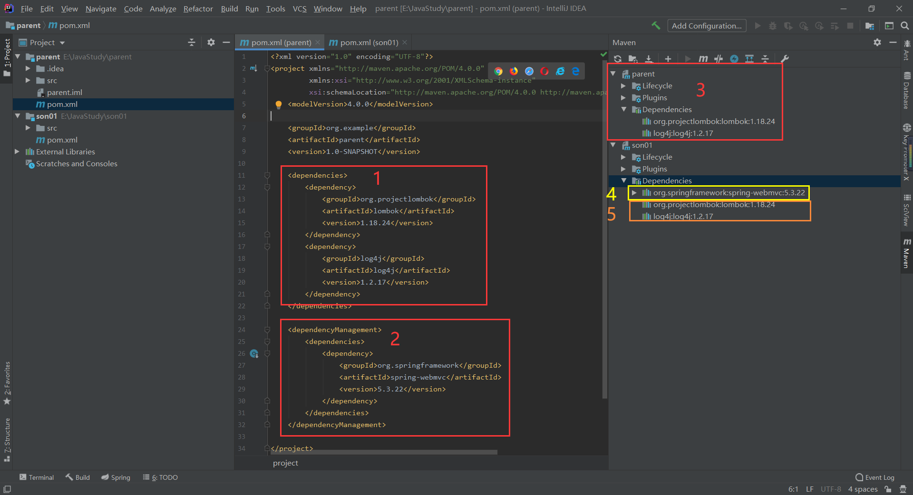
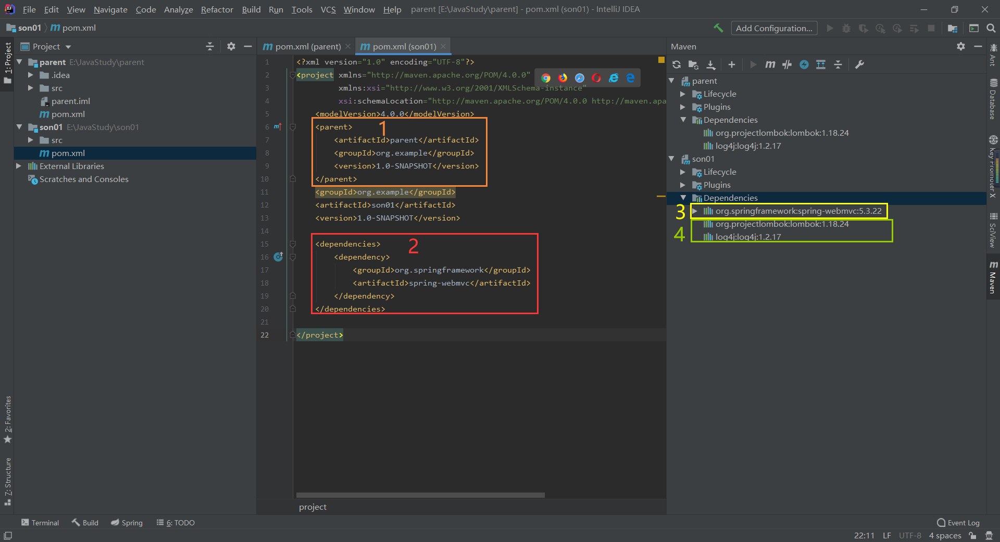
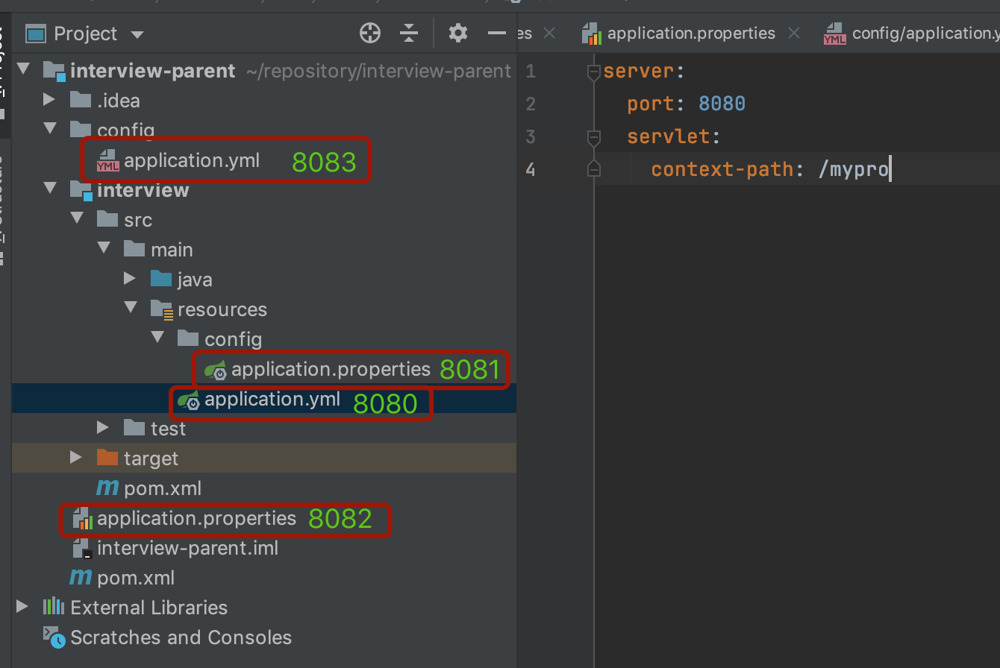
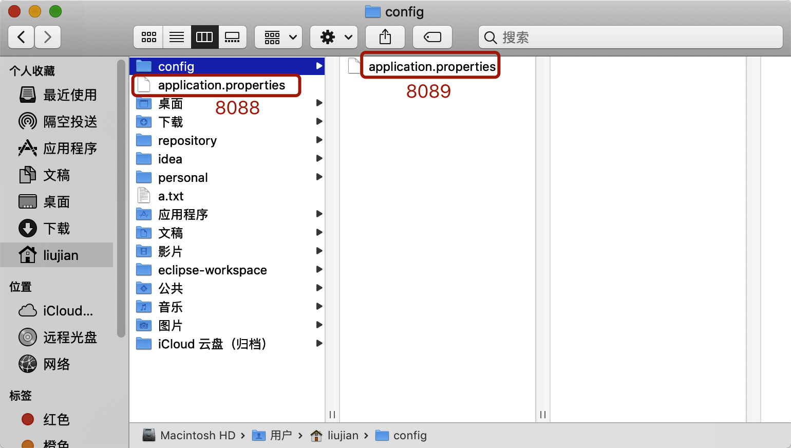
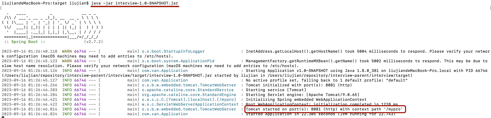
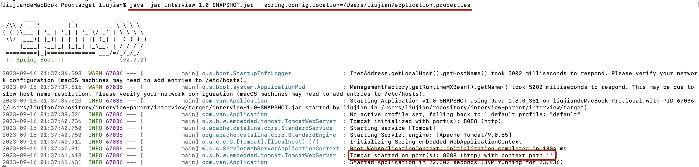
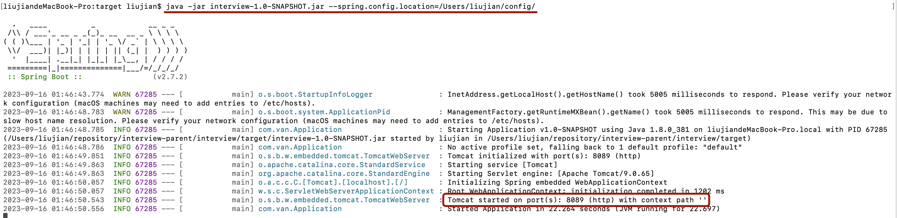
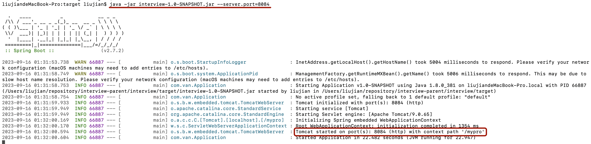
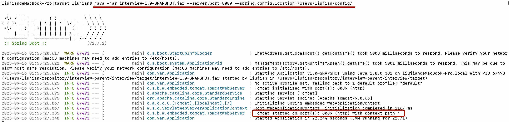

# springboot

> pom.xml中parent、dependencyManagement、dependencies的关系。

首先parent项目中dependencies中的依赖，会全部自动依赖到子项目中。parent项目中的dependencyManagement里的依赖不会自动导入到子项目中。但是可以在子项目中手动导入，手动导入的时候不需要写版本号。

举例：

下图1是parent项目中的依赖，从3可以看出2不在parent项目中。



下图是son01的依赖，如果写了parent标签，那么父项目的dependencies中的所有依赖都会被自动导入。只有手动添加了2，才会有2的依赖。



> springboot优点

- 快速构建一个spring应用程序
- 嵌入的Tomcat、Jetty、Undertow，无须部署war文件。
- 提供starter poms来简化Maven配置，减少版本冲突。
- 对spring和第三方库提供默认配置，也可以修改默认值。
- 提供生产就绪型功能，如指标、健康检查和外部配置。
- 无须配置xml，无代码生成，开箱即用。

> 如果要打成jar包，需要添加如下插件的依赖，否则会报没有主清单属性的错误。

注：有时间可以了解一下MANIFEST.MF文件

```xml
<build>
    <plugins>
        <plugin>
            <groupId>org.springframework.boot</groupId>
            <artifactId>spring-boot-maven-plugin</artifactId>
        </plugin>
    </plugins>
</build>
```

> Application启动类

@SpringBootApplication注解添加在启动类上

> @ComponentScan扫描包

如果没写basePackages属性，就会自动设置当前启动类所在的包。

> Maven Pom和Maven Project区别

Maven Pom创建的时候默认没有目录，只有pom.xml文件，用来项目管理的。

Maven Project创建的时候有src/main/java目录。

> Spring Application

官网：<a href="https://docs.spring.io/spring-boot/docs/2.7.15/reference/html/features.html#features.spring-application">Spring Application</a>

可以通过这个类增加监听器等功能，也可以关闭banner图标。

加载外部配置文件。

```java
@SpringBootApplication
public class Application {
    public static void main(String[] args) {
        SpringApplication springApplication = new SpringApplication(Application.class);
        //关闭Banner图标显示。
        springApplication.setBannerMode(Banner.Mode.OFF);
        //加载外部配置文件
        //springApplication.setDefaultProperties();
        springApplication.run(args);
    }
}
```

如果要使用Spring Application，需要new出这个对象，并且类字节文件要在new的时候传进去。

> 配置文件

<a href="https://docs.spring.io/spring-boot/docs/current/reference/html/features.html#features.external-config">官网地址</a>

application.yml > application.yaml > application.properties

从yml开始向后扫描，如果配置项有冲突的，按照已有的来。如果后面的配置文件有，但前面的配置文件没有，也会添加进去。

------------------------------------------------------------------------------------------------------------------------------------------------

除了配置文件本身，配置文件的路径也有优先级。

优先级由低到高：

- classpath:application.yml等
- classpath:config/application.yml等
- 项目根路径:application.yml等
- 项目根路径:config/application.yml等
- 命令行设置配置文件路径，可以设置文件夹，也可以设置具体的配置文件
  - 如果设置文件夹，那么文件夹后面必须要带/
- 命令行设置启动参数 --server.port

首先看一下所有的配置文件：

 

这是外部配置文件

 


我在idea中启动项目，一切都正常，按照上面所说的配置文件顺序的优先级。

**== 当我把interview打成jar包启动时，端口号是8081，而不是8083 ==**

因为这是maven的编译特性决定的，maven有约定大于配置的规定

- 代码必须放在src/main/java中，资源配置文件必须放在resource中，测试文件必须放在test中。所以项目根目录的那些配置不符合maven规范，在编译的时候不会编译到类路径中。

 


看下面的context path为空，因为是设置了外部配置文件 --spring.config.location

 

设置外部配置文件也可以直接设置文件夹，注意文件夹末尾必须有/

 


命令行参数启动不会使项目类路径中的配置文件失效，但是命令行参数设置配置文件会使类路径中的配置文件失效。 --server.port

 


当命令行参数和命令行配置文件都设置的时候，如果有冲突的，以命令行参数为主。

 

> 小知识

- resource文件夹下面的配置文件在编译的时候会被编译到class文件夹下。所以可以理解为resource文件夹就是classpath根目录。
- ContextPath must start with '/' and not end with '/'
- 可以一个功能放在一个包中，不需要分controller、dao、service什么的，那样不好找具体的功能。
- `如果我在命令行启动jar包的时候使用spring.config.location设置配置文件路径，那么根目录下的所有配置文件都会被忽略，不会被加载。但是我在命令行直接设置参数的话不会忽略类路径下的配置文件。`


# 课后题目

1. springboot的作用？
2. springboot有哪些特性？

