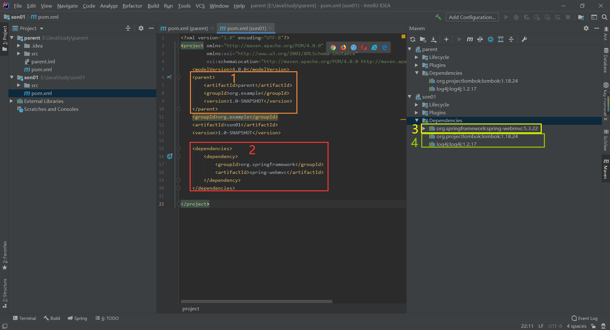
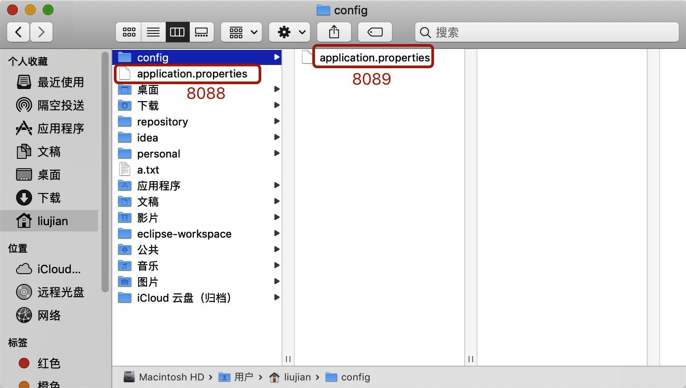
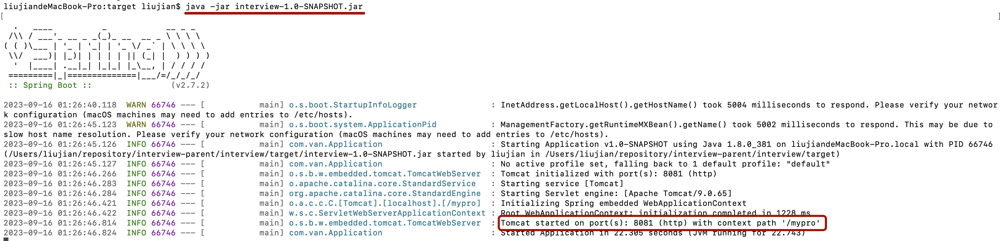
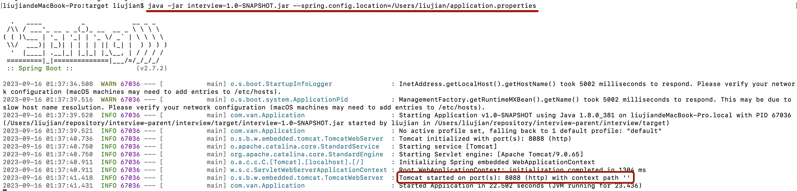
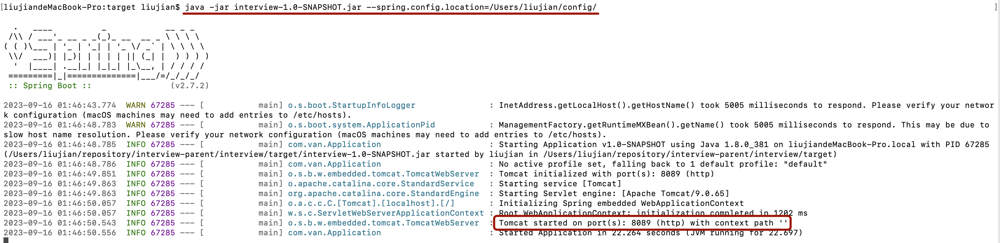
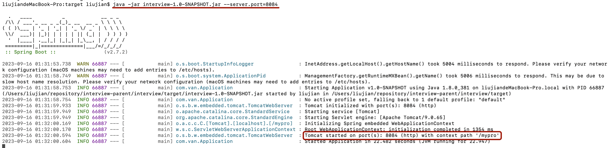

# springboot配置文件

## dependencyManagement

> pom.xml中parent、dependencyManagement、dependencies的关系。

首先parent项目中dependencies中的依赖，会全部自动依赖到子项目中。parent项目中的dependencyManagement里的依赖不会自动导入到子项目中。但是可以在子项目中手动导入，手动导入的时候不需要写版本号。

举例：

下图1是parent项目中的依赖，从3可以看出2不在parent项目中。


下图是son01的依赖，如果写了parent标签，那么父项目的dependencies中的所有依赖都会被自动导入。只有手动添加了2，才会有2的依赖。



> springboot优点

- 快速构建一个spring应用程序
- 嵌入的Tomcat、Jetty、Undertow，无须部署war文件。
- 提供starter poms来简化Maven配置，减少版本冲突。
- 对spring和第三方库提供默认配置，也可以修改默认值。
- 提供生产就绪型功能，如指标、健康检查和外部配置。
- 无须配置xml，无代码生成，开箱即用。

> 如果要打成jar包，需要添加如下插件的依赖，否则会报没有主清单属性的错误。

注：有时间可以了解一下MANIFEST.MF文件

```xml
<build>
    <plugins>
        <plugin>
            <groupId>org.springframework.boot</groupId>
            <artifactId>spring-boot-maven-plugin</artifactId>
        </plugin>
    </plugins>
</build>
```

## SpringBoot配置

> Application启动类

@SpringBootApplication注解添加在启动类上

> @ComponentScan扫描包

如果没写basePackages属性，就会自动设置当前启动类所在的包。

> Maven Pom和Maven Project区别

Maven Pom创建的时候默认没有目录，只有pom.xml文件，用来项目管理的。

Maven Project创建的时候有src/main/java目录。

> Spring Application

官网：<a href="https://docs.spring.io/spring-boot/docs/2.7.15/reference/html/features.html#features.spring-application">Spring Application</a>

可以通过这个类增加监听器等功能，也可以关闭banner图标。

加载外部配置文件。

```java
@SpringBootApplication
public class Application {
    public static void main(String[] args) {
        SpringApplication springApplication = new SpringApplication(Application.class);
        //关闭Banner图标显示。
        springApplication.setBannerMode(Banner.Mode.OFF);
        //加载外部配置文件
        //springApplication.setDefaultProperties();
        springApplication.run(args);
    }
}
```

如果要使用Spring Application，需要new出这个对象，并且类字节文件要在new的时候传进去。

### 单环境配置

> 配置文件

<a href="https://docs.spring.io/spring-boot/docs/current/reference/html/features.html#features.external-config">官网地址</a>

application.yml > application.yaml > application.properties

从yml开始向后扫描，如果配置项有冲突的，按照已有的来。如果后面的配置文件有，但前面的配置文件没有，也会添加进去。

------------------------------------------------------------------------------------------------------------------------------------------------

除了配置文件本身，配置文件的路径也有优先级。

优先级由低到高：

- classpath:application.yml等
- classpath:config/application.yml等
- 项目根路径:application.yml等
- 项目根路径:config/application.yml等
- 命令行设置配置文件路径，可以设置文件夹，也可以设置具体的配置文件
  - 如果设置文件夹，那么文件夹后面必须要带/
- 命令行设置启动参数 --server.port

首先看一下所有的配置文件：


这是外部配置文件



 

我在idea中启动项目，一切都正常，按照上面所说的配置文件顺序的优先级。

**== 当我把interview打成jar包启动时，端口号是8081，而不是8083 ==**

因为这是maven的编译特性决定的，maven有约定大于配置的规定

- 代码必须放在src/main/java中，资源配置文件必须放在resource中，测试文件必须放在test中。所以项目根目录的那些配置不符合maven规范，在编译的时候不会编译到类路径中。



 

看下面的context path为空，因为是设置了外部配置文件 --spring.config.location



 

设置外部配置文件也可以直接设置文件夹，注意文件夹末尾必须有/



 

命令行参数启动不会使项目类路径中的配置文件失效，但是命令行参数设置配置文件会使类路径中的配置文件失效。 --server.port



 

当命令行参数和命令行配置文件都设置的时候，如果有冲突的，以命令行参数为主。


 

### 多环境配置

我们可以在application.yml中配置环境

```yaml
spring:
  profiles:
    active: dev # 设置环境为dev，那么它就会找application-dev.yaml这类配置文件，在那一个优先级路径中的所有配置文件，以dev结尾的为主，其他的照样是补充。但是配置文件之间路径的优先级不会收影响，比如我现在的环境是dev，我config下的application.yml配置文件设置端口号为8081，resources下的application-dev.yml设置端口号为8082，它照样会按照8081来启动。
```

#### @Profile注解

可以修饰在类、方法、配置类上。

1. 修饰在类上

   这个类得已经注入到spring容器中

   被修饰的类只会在符合的环境下实例化，否则不会。

   比如我现在有两个数据源，想要在开发环境使用C3p0，生产环境使用Druid。

   `this is datasource interface`

   ```java
   public interface MyDataSource {
       String say();
   }
   ```

   `this is DruidDataSource`

   ```java
   @Profile("pro")
   @Component
   public class DruidDataSource implements MyDataSource {
       public String say() {
           return "pro";
       }
   }
   ```

   `this is C3p0DataSource`

   ```java
   @Profile("dev")
   @Component
   public class C3p0DataSource implements MyDataSource {
       public String say() {
           return "dev";
       }
   }
   ```

   later we choose a environment in application.yml

   ```yaml
   server:
     port: 8080
     servlet:
       context-path: /mypro
   spring:
     profiles:
       active: dev
   ```

   we chose the dev, so C3p0DataSource will not be injected in spring.

2. 修饰在方法上

   通常和@Bean一起使用

3. 修饰在配置类上

   和@Configuration一起使用

### 外部文件配置

<a href="https://docs.spring.io/spring-boot/docs/current/reference/html/features.html#features.external-config.files.wildcard-locations">通配符配置</a> 默认是自动设置的config下的/*/。

为什么需要这个配置？

当我想要一个服务设置一个配置文件，将不同的服务分开的时候，这个就完美的解决了我们的问题。可以在jar包所在的文件夹下新建config，并在config下新建其他服务文件夹（redis、mysql、mq等），并在这些文件夹下新建各自的application配置文件。

如下，当我启动jar包时，优先级最高的配置文件为1⃣️，按照从高到低到顺序标了序号1-3。

如果2中的两个配置文件有冲突，比如一个端口号设置为8090，一个设置为8091，那么后加载到的配置文件会覆盖之前加载的配置。可以通过debug查看谁先加载。

总之1可以覆盖2，2可以覆盖3。


 

<a href="https://docs.spring.io/spring-boot/docs/current/reference/html/features.html#features.external-config">外部配置文件优先级</a>

1.  `SpringApplication.setDefaultProperties`.(只能是properties)

2. [`@PropertySource annotations`](https://docs.spring.io/spring-framework/docs/6.0.11/javadoc-api/org/springframework/context/annotation/PropertySource.html) （只能是properties）

3.  `application.properties files`，可以是yml

4. OS environment variables.

   a）通过idea设置

   

   b）通过命令行设置，在命令行设置环境变量，但是只在当前终端有效，终端关闭后不存在了。

   每个操作系统的命令都不一样，假设是设置端口号

   windows的命令：set server.port=8099

   mac的命令: export server_port=8099

   设置完端口号后执行java -jar就可以了。但是设置端口号只对当前命令行窗口有效，一旦关闭就无了。

5. Java System properties (`System.getProperties()`).

   a）idea设置

   

   b）命令行设置 java -Dserver.port=8097 -jar xxx.jar

   

6. JNDI attributes from `java:comp/env`.

7. `ServletContext` init parameters.

8. `ServletConfig` init parameters.

9. Properties from `SPRING_APPLICATION_JSON` (inline JSON embedded in an environment variable or system property).

10. Command line arguments.优先级最高

11. `properties` attribute on your tests. Available on [`@SpringBootTest`](https://docs.spring.io/spring-boot/docs/3.1.3/api/org/springframework/boot/test/context/SpringBootTest.html) and the [test annotations for testing a particular slice of your application](https://docs.spring.io/spring-boot/docs/current/reference/html/features.html#features.testing.spring-boot-applications.autoconfigured-tests).

12. [`@DynamicPropertySource`](https://docs.spring.io/spring-framework/docs/6.0.11/javadoc-api/org/springframework/test/context/DynamicPropertySource.html) annotations in your tests.

13. [`@TestPropertySource`](https://docs.spring.io/spring-framework/docs/6.0.11/javadoc-api/org/springframework/test/context/TestPropertySource.html) annotations on your tests.

    用在单元测试上

14. [Devtools global settings properties](https://docs.spring.io/spring-boot/docs/current/reference/html/using.html#using.devtools.globalsettings) in the `$HOME/.config/spring-boot` directory when devtools is active.

### 配置总结

如果是jar包运行，以java -jar直接运行的：

- 优先级最高的是jar包所在的文件夹，看其中有没有application.yml或者application-{profile}.yml配置文件。如果有，那么他们的优先级最高。当然jar包所在的文件夹如果有config文件夹，那么他们的优先级才是最高的。

- 其次看jar包之内的优先级，按照以前说过的一样。

如果是jar包运行，直接设置配置文件路径的，不会自动补充其他配置。

> 小知识

- resource文件夹下面的配置文件在编译的时候会被编译到class文件夹下。所以可以理解为resource文件夹就是classpath根目录。
- ContextPath must start with '/' and not end with '/'
- 可以一个功能放在一个包中，不需要分controller、dao、service什么的，那样不好找具体的功能。
- `如果我在命令行启动jar包的时候使用spring.config.location设置配置文件路径，那么根目录下的所有配置文件都会被忽略，不会被加载。但是我在命令行直接设置某一个参数的话不会忽略类路径下的配置文件。`
- `在同一路径位置下`，配置文件优先级是profile > yml > yaml > properties。


# 课后题目

1. springboot的作用？
2. springboot有哪些特性？
3. springboot配置的优先级？

