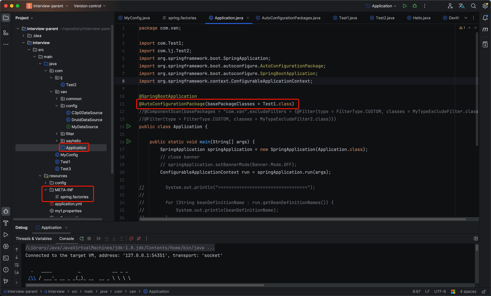

# 自动配置原理1

<a href="https://www.processon.com/view/65354823d657a234397f6259#pc">笔记图解链接</a>

###### 元注解(Meta-Annotations)

1. 定义：用于注解其他注解的注解。用于定义和配置自定义注解的注解。

2. 功能：元注解提供了自定义注解的元信息，保留策略，目标元素类型，是否被继承等信息。

3. 常用的元注解：

   - @Retention：指定自定义注解的保留策略，注解在何时有效。

     提供了三种策略:

     1. RetentionPolicy.SOURCE，不包含在编译后的字节码文件，也不在运行环境中。
     2. RetentionPolicy.CLASS，注解被编译时会保留在字节码文件中，但不会在运行环境中。
     3. RetentionPolicy.RUNTIME，注解会被编译保存到字节码，也可以在运行时通过反射获取。可以在程序运行时影响类的行为。

   - @Target：指定自定义注解的使用范围。

     接收一个ElementType数组，每个元素都表示可用于哪里。

     常见的ElementType类型：

     - ElementType.TYPE：用于类、接口、枚举等。
     - ElementType.FIELD：用于字段(包括枚举常量)。
     - ElementType.METHOD：用于方法。
     - ElementType.PARAMETER：用于方法参数
     - ElementType.CONSTRUCTOR：用于构造方法
     - ElementType.LOCAL_VARIABLE：用于局部变量
     - ElementType.ANNOTATION_TYPE：用于注解类型
     - ElementType.PACKAGE：用于包声明

   - @Documented：指定注解是否应该被包含在生成的文档中。

   - @Inherited：指定注解是否需要被子类继承。

   - @Repeatable：指定注解是否可以重复定义在一个元素上。

     - 举例：

       ```java
       public class Test1 {
           public static void main(String[] args) throws NoSuchMethodException {
               Test1 test1 = new Test1();
               Method a = test1.getClass().getMethod("a");
               Annotation[] annotations = a.getAnnotations();
               for (Annotation annotation: annotations) {
                   System.out.println(annotation);
                   //输出结果：
                   //@com.van.common.Annotation1s(value=[@com.van.common.Annotation1(name=name1), @com.van.common.Annotation1(name=name2)])
                   //只输出了一个Annotation1s，说明自动将他们合并为一个了。
               }
           }
           @Annotation1(name = "name1")
           @Annotation1(name = "name2")
           public static void a() {}
       }
       
       @Repeatable(Annotation1s.class)
       @interface Annotation1 {
           String name();
       }
       
       @Retention(RetentionPolicy.RUNTIME)
       @interface Annotation1s {
           Annotation1[] value();
       }
       ```

###### @ComponentScan

- basePackages：指定要扫描的包路径，默认是注解所在类所在的包及其子包。

- excludeFilters：设置排除规则，让哪些类不注入spring中。

  ==TypeExcludeFilter：==

  SpringBootApplication注解中的ComponentScan是这样写的

  ```java
  @ComponentScan(excludeFilters = { @Filter(type = FilterType.CUSTOM, classes = TypeExcludeFilter.class),
  		@Filter(type = FilterType.CUSTOM, classes = AutoConfigurationExcludeFilter.class) })
  public @interface SpringBootApplication {}
  ```

  我们如果要自己设置规则，那么需要写一个过滤类继承TypeExcludeFilter，重写match方法。

  ```java
  public class MyTypeExcludeFilter extends TypeExcludeFilter {
  
      @Override
      public boolean match(MetadataReader metadataReader, MetadataReaderFactory metadataReaderFactory) throws IOException {
          //如果是Hello类，就排除掉。
          //TODO metadataReader.getClassMetadata可以获取到类的信息。但不能通过其getClass方法来判断是否是某个类的对象。这里的getClass方法存疑，所以就用getClassName来判断
          return metadataReader.getClassMetadata().getClassName().equals(Hello.class.getName());
      }
  }
  ```

  类准备好后，在启动类上写@ComponentScan注解的时候，添加上这个过滤规则。

  ```java
  @ComponentScan(basePackages = "com.van",excludeFilters = {@Filter(type = FilterType.CUSTOM, classes = MyTypeExcludeFilter.class)})
  public class Application {}
  ```

  //针对上述问题有一个疑问，@ComponentScan应该不存在覆盖吧，这个设置规则和另一个规则冲突了会怎么样？例如我typeexcludefilter设置Hello不注入，typeexcludeFilter2设置全部注入，试了一下答案是不会注入。

  //还有一个问题，在SpringBootApplication中有ComponentScan这个注解，它设置的规则和我在外面启动类上设置的会有什么冲突吗？

  我猜测底层可能是每一个被Component类似注解修饰的类过来都会走一遍过滤规则，一个类过来就所有规则都过一遍，如果都符合才注入，否则不会。这个类判断结束再判断下一个类

  ==AutoConfigurationExcludeFilter：==

  SpringBootApplication注解中的ComponentScan还有AutoConfigurationExcludeFilter，用来排除所有配置类`且是自动配置类`。

###### `@AutoConfigurationPackage`

此注解在@EnableAutoConfiguration上，@EnableAutoConfiguration又在@SpringBootApplication上。

将配置类所在的包保存在BasePackages的Bean中，供Spring内部使用。

作用：设置自动配置类扫描的包路径

解释一下：AutoConfigurationPackage只是设置扫描包路径。https://blog.csdn.net/agonie201218/article/details/132017588

在启动类中设置@AutoConfigurationPackage，可以传入basePackages或basePackageClasses。

传入basePackages：扫描传入的包

传入basePackageClasses：扫描传入的类所在的包。

如果想要使用这个注解，可以在spring.factories中设置类为自动配置类。

```factories
org.springframework.boot.autoconfigure.EnableAutoConfiguration=com.MyConfig
```

```java
@Configuration
public class MyConfig {
    @Bean
    public Test2 test2() {
        return new Test2();
    }
}
```

此时MyConfig和Test2都注入了spring中。Test1和Test3没有注入。总结一下：在启动类上设置basePackageClasses为Test1，那么自动配置类扫描的包路径为Test1所在的包，扫描到MyConfig发现它是自动配置类，那么就会注入到spring中，MyConfig其中的@Bean也会注入到spring中，所以Test2也注入了spring。Test1和Test3既不是自动配置类，也没有在自动配置类中使用@Bean注入，所以不在spring中。




###### @Import

需要放在@Component或者@Configuration这类注解上搭配使用，单独一个Import是不行的。

1. import一个普通类，spring会将该类注入到容器。

   ```java
   public class Test3 {
       public String a() {
           return "test3";
       }
   }
   ```

   ```java
   @Component
   @Import(Test3.class)
   public class Hello {
       public Hello() {
       }
   }
   ```

2. import一个实现了ImportBeanDefinitionRegistar接口的类，在重写的registerBeanDefinitions方法里面，能拿到BeanDefinitionRegistry的注册器，能手工往beanDefinitionMap中注册beanDefinition。

   ```java
   public class Test1 {
       public String a() {
           return "aaa";
       }
   }
   ```

   ```java
   public class Test3 implements ImportBeanDefinitionRegistrar {
       @Override
       public void registerBeanDefinitions(AnnotationMetadata importingClassMetadata, BeanDefinitionRegistry registry) {
         //创建一个BeanDefinition
           RootBeanDefinition definition = new RootBeanDefinition();
           definition.setBeanClass(Test1.class);
           registry.registerBeanDefinition("test1",definition);
       }
   }
   ```

   ```java
   @Component
   @Import(Test3.class)
   public class Hello {
       public Hello() {
       }
   }
   ```

   上述只会将Test1注入到容器，Test3不会注入。

3. @Import一个类，该类实现了ImportSelector 重写selectImports方法，该方法返回了String[]数组的对象，数组里面的类都会注入到spring容器当中。

   ```java
   public class Test2 {
   }
   ```

   ```java
   public class Test3 implements ImportSelector {
       @Override
       public String[] selectImports(AnnotationMetadata importingClassMetadata) {
           return new String[]{Test2.class.getName()};
       }
   }
   ```

   ```java
   @Component
   @Import(Test3.class)
   public class Hello {
       public Hello() {
       }
   }
   ```

   如此Test2就被导入容器了。

4. 如果我让ImportSelector和ImportBeanDefinitionRegistrar都被同一个类实现，我在调试的时候发现并没有走入registerBeanDefinitions方法中。但是selectImports方法执行了。说明两者不能用同一个类实现。

###### ImportSelector

这个接口在被一个类实现后，那个类被Import进入一个spring配置类或者被Component这类注解修饰的类中。

就是上面@Import注解的第三点。

其有一个子接口DeferredImportSelector（Deferred：延迟），顾名思义延迟导入选择器。

`DeferredImportSelector` : A variation of ImportSelector that runs after all @Configuration beans have been processed.

是ImportSelector的一个变种，在所有的Configuration bean处理完后执行。

###### AutoConfigurationImportSelector

AutoConfigurationImportSelector实现了DeferredImportSelector，DeferredImportSelector继承自ImportSelector，如果DeferredImportSelector的实现类实现了getImportGroup方法并返回一个DeferredImportSelector.Group的实现类，那么就会执行返回的Group实现类的process和selectImports方法，否则执行DeferredImportSelector实现类的selectImports方法。

###### 流程整理

1. @SpringBootApplication

2. @EnableAutoConfiguration
3. @Import(AutoConfigurationImportSelector.class)`AutoConfigurationImportSelector实现了DeferredImportSelector`
4. getImportGroup方法
5. process、selectImports
6. getAutoConfigurationEntry
7. getCandidateConfigurations
8. loadFactoryNames(加载spring.factories)、load(加载自动配置类org.springframework.boot.autoconfigure.AutoConfiguration.imports)
9. loadFactoryNames->loadSpringFactories、load->readAutoConfigurations
10. getCandidateConfigurations执行完后要过滤，只留下需要用到的自动配置类。filter

```java
protected AutoConfigurationEntry getAutoConfigurationEntry(AnnotationMetadata annotationMetadata) {
    if (!isEnabled(annotationMetadata)) {
       return EMPTY_ENTRY;
    }
    AnnotationAttributes attributes = getAttributes(annotationMetadata);
    List<String> configurations = getCandidateConfigurations(annotationMetadata, attributes);
    configurations = removeDuplicates(configurations);
    Set<String> exclusions = getExclusions(annotationMetadata, attributes);
    checkExcludedClasses(configurations, exclusions);
    configurations.removeAll(exclusions);
    configurations = getConfigurationClassFilter().filter(configurations);
    fireAutoConfigurationImportEvents(configurations, exclusions);
    return new AutoConfigurationEntry(configurations, exclusions);
}
```

> 注意点

- loadFactoryNames方法在启动类new SpringApplication构造方法的时候就执行过了，再次进入的时候进入loadSpringFactories如果已经在缓存中找到了，就会直接返回。
- load方法才会加载自动配置类，loadFactoryNames只会加载spring.factories中的配置，但是如果spring.factories中也放自动配置类，那么也会加载成功。springboot从2.7开始就不在使用spring.factories存放所有的配置类了。自动配置类都存放在org.springframework.boot.autoconfigure.AutoConfiguration.imports中。

