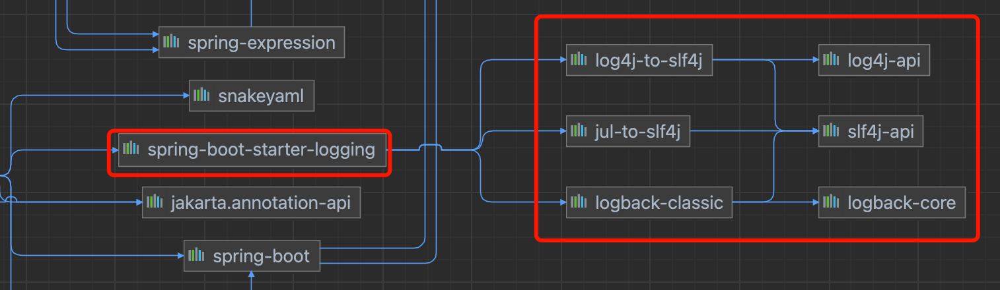
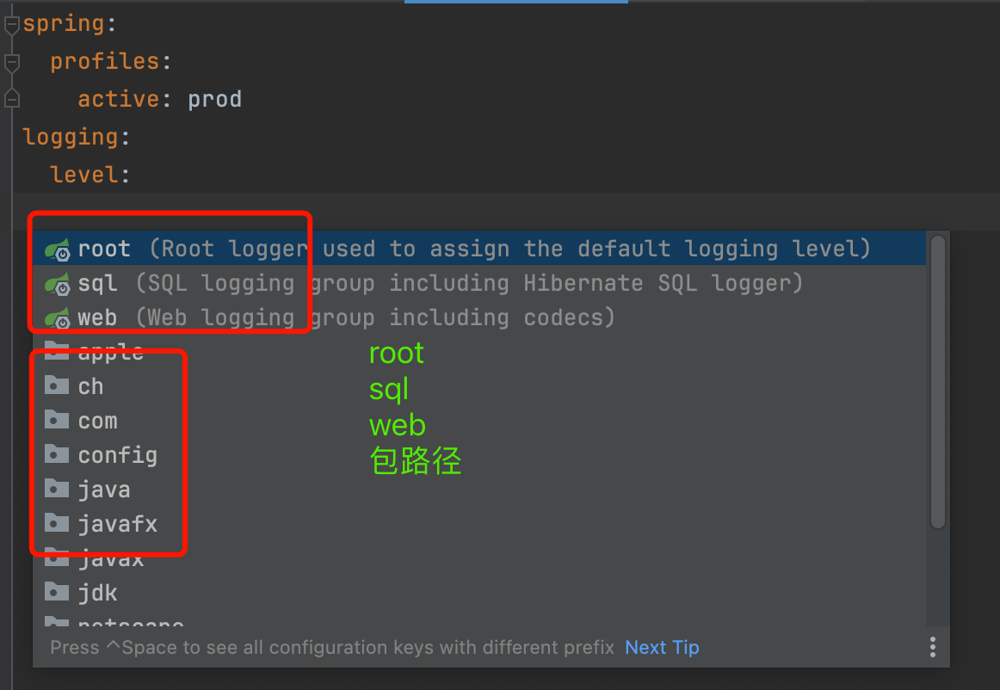

# SpringBoot日志

## springboot默认依赖体系



1. springboot底层采用logback+slf4j方式记录日志

   logback-classic：它是slf4j的一个实现，不是桥接器也不是适配器。

2. springboot把其它日志转换为slf4j

   log4j-to-slf4j：log4j适配

   jul-to-slf4j：jul适配

   

## 日志使用配置

- 日志级别

  TRACE、DEBUG、INFO、WARN、ERROR、FATAL、OFF

- 可以设置root全部路径的日志，也可以设置某个包的日志级别。如果设置级别为debug，那么info，warn，error，fatal都会显示出来，比它优先级低的才不会显示。

  

  ```yaml
  logging:
    level:
    	# 设置com.van包下的日志级别为trace，其它的都还是原来默认的
      com.van: trace
  ```

## 日志格式

默认springboot日志输出：

```bash
2023-10-19 06:25:19.176  INFO 26657 --- [           main] o.s.b.d.f.logexample.MyApplication       : Starting MyApplication using Java 1.8.0_392 on myhost with PID 26657 (/opt/apps/myapp.jar started by myuser in /opt/apps/)
2023-10-19 06:25:19.184  INFO 26657 --- [           main] o.s.b.d.f.logexample.MyApplication       : No active profile set, falling back to 1 default profile: "default"
2023-10-19 06:25:20.583  INFO 26657 --- [           main] o.s.b.w.embedded.tomcat.TomcatWebServer  : Tomcat initialized with port(s): 8080 (http)
2023-10-19 06:25:20.599  INFO 26657 --- [           main] o.apache.catalina.core.StandardService   : Starting service [Tomcat]
2023-10-19 06:25:20.599  INFO 26657 --- [           main] org.apache.catalina.core.StandardEngine  : Starting Servlet engine: [Apache Tomcat/9.0.82]
2023-10-19 06:25:20.738  INFO 26657 --- [           main] o.a.c.c.C.[Tomcat].[localhost].[/]       : Initializing Spring embedded WebApplicationContext
2023-10-19 06:25:20.738  INFO 26657 --- [           main] w.s.c.ServletWebServerApplicationContext : Root WebApplicationContext: initialization completed in 1489 ms
2023-10-19 06:25:21.272  INFO 26657 --- [           main] o.s.b.w.embedded.tomcat.TomcatWebServer  : Tomcat started on port(s): 8080 (http) with context path ''
2023-10-19 06:25:21.286  INFO 26657 --- [           main] o.s.b.d.f.logexample.MyApplication       : Started MyApplication in 2.65 seconds (JVM running for 3.109)
```

拿第一行日志来举例

1. 日期以及时间，精确到毫秒

   2023-10-19 06:25:19.176

2. 日志级别

   INFO

3. 进程号

   26657

4. 分隔符 ---

5. 线程名称

   [           main]

6. 日志的名称，记录这条日志的“日志器”

   o.s.b.d.f.logexample.MyApplication

7. 日志信息

   Starting MyApplication using Java 1.8.0_392 on myhost with PID 26657 (/opt/apps/myapp.jar started by myuser in /opt/apps/)

### 格式介绍：

[`logging.pattern.console`](https://docs.spring.io/spring-boot/docs/2.7.17/reference/html/application-properties.html#application-properties.core.logging.pattern.console) 属性设置了输出格式

默认值：

```bash
%clr(%d{${LOG_DATEFORMAT_PATTERN:-yyyy-MM-dd HH:mm:ss.SSS}}){faint} %clr(${LOG_LEVEL_PATTERN:-%5p}) %clr(${PID:- }){magenta} %clr(---){faint} %clr([%15.15t]){faint} %clr(%-40.40logger{39}){cyan} %clr(:){faint} %m%n${LOG_EXCEPTION_CONVERSION_WORD:-%wEx}
```

- %clr {faint} 设置颜色，faint是默认无颜色。%clr {red}设置红色。如果%clr后面没有设置颜色，即为默认颜色。
- ${LOG_DATEFORMAT_PATTERN:-yyyy-MM-dd HH:mm:ss.SSS}
  - 如果系统环境变量中LOG_DATEFORMAT_PATTERN为null，结果为-yyyy-MM-dd HH:mm:ss:SSS，否则该是多少就是多少。
- %d{}表示设置日期：<a href="https://logback.qos.ch/manual/layouts.html#date">官网</a> logback设置的格式。
- %clr(${LOG_LEVEL_PATTERN:-%5p})
  - %5表示向左对齐，保持五个字符的长度。
  - <a href="https://logback.qos.ch/manual/layouts.html#level">p</a>：日志的级别

针对上述格式，有${系统属性}，这个系统属性也可以通过配置文件修改，<a href="https://docs.spring.io/spring-boot/docs/2.7.17/reference/html/features.html#features.logging.custom-log-configuration">官网</a> 。

为什么可以通过配置文件修改？因为通过监听器将配置文件中的值设置到系统环境变量中。


## 日志文件

怎么让日志以文件方式记录？

```bash
# 两个属性
logging.file.name: 如果没有设置路径，只设置文件名，会默认生成在根目录中。
logging.file.path: 指定路径，默认指定spring.log为文件名。
```

`if both name and path all setted,the name will effective and the path will invalid`

如果name和path都指定了，那么name会生效，path失效。


## File Rotation

如果使用Logback，可以直接在application.yml中配置轮转策略。使用其它的日志框架，比如log4j2就需要自己添加log4j2.xml或者log4j2-spring.xml

| Name                                                   | Description                      |
| :----------------------------------------------------- | :------------------------------- |
| `logging.logback.rollingpolicy.file-name-pattern`      | 归档的文件名                     |
| `logging.logback.rollingpolicy.clean-history-on-start` | 在应用程序启动时清除归档文件     |
| `logging.logback.rollingpolicy.max-file-size`          | 归档前日志文件的最大大小         |
| `logging.logback.rollingpolicy.total-size-cap`         | 删除日志档案前可以使用的最大大小 |
| `logging.logback.rollingpolicy.max-history`            | 保留日志存档天数，默认7天        |

```yaml
logging:
  level:
    com.van: trace
  file:
    name: /Users/liujian/repository/interview-parent/mylog.log
  logback:
    rollingpolicy:
      file-name-pattern: ${LOG_FILE}.%d{yyyy-MM-dd}.%i.gz
      max-file-size: 1KB
```

其中 file-name-pattern: ${LOG_FILE}.%d{yyyy-MM-dd}.%i.gz

- ${LOG_FILE}表示日志文件名称
- %d{yyyy-MM-dd}表示日期
- %i表示归档的第几个文件，从0开始

归档的文件会和日志文件在同一个文件夹下

`每个springboot自带的logback版本有不一样，看每个版本对应官网的配置应该是什么样的`

```yaml
#每个版本的配置方式都不一样，去官网查看即可。
#springboot 2.7.2配置
#logging:
#  logback:
#    rollingpolicy:
#      file-name-pattern: ${LOG_FILE}.%d{yyyy-MM-dd}.%i.gz
#      max-file-size: 1KB

#springboot 2.2.0.RELEASE配置
#logging:
#  file:
#    name: /Users/liujian/repository/interview-parent/mylog.log
#    max-size: 1KB
```


## 自定义配置文件

<a href="https://logback.qos.ch/manual/appenders.html">appender官方文档</a> 

如果想要使用一些高级功能就必须使用自定义配置文件

当我们设置自定义配置文件了，那么全局配置文件application.yml里的日志配置会全部失效

配置文件logback.xml

```xml
<configuration>
    <!--appender: 追加器，日志以哪种方式进行输出-->
    <appender name="STDOUT" class="ch.qos.logback.core.ConsoleAppender">
        <encoder>
            <!--格式-->
            <pattern>%d{HH:mm:ss:SSS} [%thread] %-5level %logger{100} - %msg%n</pattern>
        </encoder>
 		 </appender>
      <!--设置日志级别-->
      <logger name="com.van" level="TRACE"></logger>
      <root level="error">
        <appender-ref ref="STDOUT"/>
      </root>
</configuration>
```

如果需要设置和spring相关的内容，需要将文件名改为logback-spring.xml，比如设置springProfile

因为logback.xml会在springboot容器加载前先被logback加载到，由于logback无法解析springProfile会报错。所以改为logback-spring.xml就不会先加载。

```xml
<configuration>
    <springProfile name="dev">
        <!--appender: 追加器，日志以哪种方式进行输出-->
        <appender name="STDOUT" class="ch.qos.logback.core.ConsoleAppender">
            <encoder>
                <!--格式-->
                <pattern>%d{HH:mm:ss:SSS} [%thread] %-5level %logger{100} - %msg%n</pattern>
            </encoder>
        </appender>
    </springProfile>

    <springProfile name="prod">
        <appender name="STDOUT" class="ch.qos.logback.core.ConsoleAppender">
            <encoder>
                <pattern>%d{HH:mm:ss:SSS} [%thread] %-5level %logger{100} ======- %msg%n</pattern>
            </encoder>
        </appender>
    </springProfile>
    <!--设置日志级别-->
    <logger name="com.van" level="TRACE"></logger>
    <root level="error">
        <appender-ref ref="STDOUT"/>
    </root>
</configuration>
```

其中springProfile不只是可以放在appender外面

```xml
<configuration>
    
        <!--appender: 追加器，日志以哪种方式进行输出-->
        <appender name="STDOUT" class="ch.qos.logback.core.ConsoleAppender">
            <springProfile name="dev">
                <encoder>
                    <!--格式-->
                    <pattern>%d{HH:mm:ss:SSS} [%thread] %-5level %logger{100} - %msg%n</pattern>
                </encoder>
            </springProfile>
            <springProfile name="prod">
                <encoder>
                    <pattern>%d{HH:mm:ss:SSS} [%thread] %-5level %logger{100} ======- %msg%n</pattern>
                </encoder>
            </springProfile>
        </appender>
    </springProfile>
    <!--设置日志级别-->
    <logger name="com.van" level="TRACE"></logger>
    <root level="error">
        <appender-ref ref="STDOUT"/>
    </root>
</configuration>
```

`springProperty`

用于引用全局配置文件的值。

```xml
<configuration>
    <!--scope表示作用范围，context当前上下文。
        name：定义名称用于引用
        source：在全局配置文件的路径
        defaultValue：如果全局配置文件中没有，它的默认值
        如果其它内容来引用的时候，使用${dataformat}-->
    <springProperty scope="context" name="dataformat" source="logging.pattern.dateformat" defaultValue="-yyyy-MM-dd"/>

    <!--appender: 追加器，日志以哪种方式进行输出-->
    <appender name="STDOUT" class="ch.qos.logback.core.ConsoleAppender">
        <encoder>
            <springProfile name="dev">
                <!--格式-->
                <pattern>%d{${dataformat}} [%thread] %-5level %logger{100} - %msg%n</pattern>
            </springProfile>
            <springProfile name="prod">
                <!--格式-->
                <pattern>%d{${dataformat}} [%thread] %-5level %logger{100} -===== %msg%n</pattern>
            </springProfile>
        </encoder>
    </appender>


    <!--设置日志级别-->
    <logger name="com.van" level="TRACE"></logger>
    <root level="info">
        <appender-ref ref="STDOUT"/>
    </root>
</configuration>
```

## 切换日志框架

如果想使用log4j2，需要添加它的桥接器，这里添加一个starter，且需要将其它的桥接器都排除掉，因为只能有一个桥接器。

```xml
<dependencies>
  <dependency>
    <groupId>org.springframework.boot</groupId>
    <artifactId>spring-boot-starter-web</artifactId>
    <exclusions>
      <!--排除其它桥接器，logging里包含logback的桥接器-->
      <exclusion>
        <groupId>org.springframework.boot</groupId>
        <artifactId>spring-boot-starter-logging</artifactId>
      </exclusion>
    </exclusions>
  </dependency>
  
  <dependency>
    <groupId>org.springframework.boot</groupId>
    <artifactId>spring-boot-starter-test</artifactId>
  </dependency>
  <dependency>
    <groupId>org.springframework.boot</groupId>
    <artifactId>spring-boot-configuration-processor</artifactId>
    <!--optional为true的意思是如果别的项目依赖这个项目，那么这个依赖不会传递给子项目-->
    <optional>true</optional>
  </dependency>
  
	<!--添加log4j2的启动器-->
  <dependency>
    <groupId>org.springframework.boot</groupId>
    <artifactId>spring-boot-starter-log4j2</artifactId>
  </dependency>
</dependencies>
```

还需要添加配置文件，这里使用的是log4j2的日志，所以要添加log4j2配置文件

```xml
<?xml version="1.0" encoding="UTF-8" ?>
<configuration status="OFF">
    <appenders>
        <Console name="Console" target="SYSTEM_OUT">
            <PatternLayout pattern="%d{HH:mm:ss.SSS} [%t] %-5level %logger{36} +++%msg%n"/>
        </Console>
    </appenders>

    <loggers>
        <logger name="com.van" level="TRACE"></logger>
        <root level="info">
            <appender-ref ref="Console"/>
        </root>
    </loggers>
</configuration>
```


> 注意：

1. Logback没有Fatal级别，它被映射到error中。
1. slf4j桥接器只能有一个
1. 每个springboot版本对应的配置都不一样，要去对应版本的官网查看配置。

