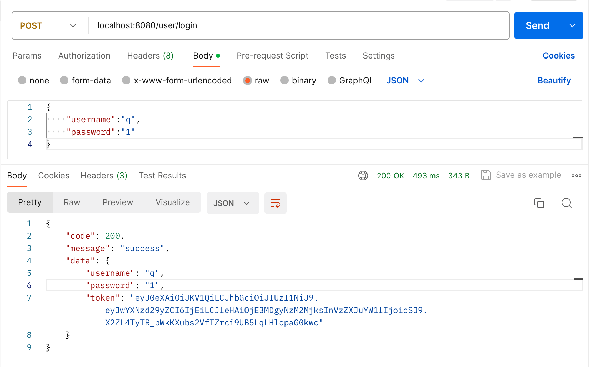
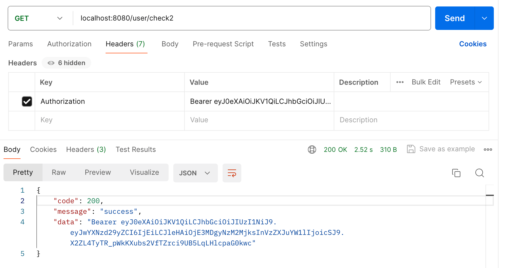

# JWT

官网介绍：https://jwt.io/introduction

1. 为什么需要JWT，哪些场景能用到？

   为什么需要：

   - 减少频繁的查询数据库，每一个用户登录后会返回给他们一个token，下次操作某些数据的时候直接验证token即可，不需要再去数据库中查询用户名密码是否正确。

   场景：

   - 授权，比如登录场景，用户登录后每个请求都包含jwt。使用户可以访问该令牌所被允许的路由，服务，资源。
   - 信息交换：可以通过signature确定发送者是谁，也可以验证内容是否被篡改过。

2. JWT组成

   由Header、Payload、Signature组成。两两之间用英文句号分割。例：`abcash.kdhgsdf.askd`

   - Header：包含typ、alg

     ```json
     {
       //alg表示signature算法是HS256
       "alg": "HS256",
       //token类型是JWT
       "typ": "JWT" 
     }
     ```

     对上述JSON进行Base64Url编码形成jwt的第一部分。

   - Payload：有效载荷，包含一些claims。claims包含一些实体和附加数据。

     claims包含三种类型：*registered*, *public*, and *private* claims.

     - registered claims不是强制的（mandatory强制的）

       包含：iss作者、exp到期时间、sub主题、aud受众等。

     - public claims由使用JWT的人定义，应该在[IANA JSON Web 令牌注册表](https://www.iana.org/assignments/jwt/jwt.xhtml)中有定义。

     - private claims同意使用的信息

     ```json
     {
       "username": "vanliu",
       "password": "888888",
       //iat是身份访问令牌的意思 identity access token
       "iat": "1516239022"
     }
     ```

     对payload进行Base64Url编码就形成了jwt的第二个部分。

     `Do note that for signed tokens this information, though protected against tampering, is readable by anyone. Do not put secret information in the payload or header elements of a JWT unless it is encrypted.`

   - Signature

     使用secret（secret是自定义的一个密钥）以及header中的算法对（将header和payload加起来的字符串）变形就得到了signature。

     signature可以验证消息在传输过程中是否发生改变。

3. JWT如何工作？

   发送jwt的时候可以放在http请求头中Authorization字段。格式举例：

   ```bash
   Authorization: Bearer <token>
   ```

   如果通过http header发送jwt，需要注意有些浏览器不接受超过8kb的header，所以jwt令牌中不能嵌入太多的信息。

4. 写一个JWT工具类

   ```xml
   <dependency>
       <groupId>com.auth0</groupId>
       <artifactId>java-jwt</artifactId>
       <version>3.19.2</version>
   </dependency>
   ```

   ```java
   package van.commons.utils;
   
   import com.auth0.jwt.JWT;
   import com.auth0.jwt.JWTVerifier;
   import com.auth0.jwt.algorithms.Algorithm;
   import com.auth0.jwt.interfaces.DecodedJWT;
   import lombok.extern.slf4j.Slf4j;
   import van.dao.LoginVO;
   
   import java.util.Date;
   import java.util.HashMap;
   @Slf4j
   public class JwtUtils {
       private static final String TOKEN_SECRET = "vanliu";
       //过期时间，设置24小时
       private static final long EXPIRE_TIME = 1000 * 60 * 60 * 24;
   
       //创建token
       public static String create(LoginVO loginVO) {
   
           HashMap<String, Object> map = new HashMap<>();
           map.put("alg", "HS256");
           map.put("typ", "JWT");
           String token = JWT.create().withHeader(map)
                   .withClaim("username", loginVO.getUsername())
                   .withClaim("password", loginVO.getPassword())
                   .withExpiresAt(new Date(System.currentTimeMillis() + EXPIRE_TIME))
                   .sign(Algorithm.HMAC256(TOKEN_SECRET));
           return token;
       }
   
       //校验token是否合法
       public static boolean check(String token) {
           DecodedJWT decodedJWT = null;
           try {
               Algorithm algorithm = Algorithm.HMAC256(TOKEN_SECRET);
               JWTVerifier verifier = JWT.require(algorithm).build();
               decodedJWT = verifier.verify(token);
           } catch (Exception e) {
               //捕获到异常，说明token有问题,过期的话也会捕获到。
               log.info(e.getMessage());
               return false;
           }
   
           return true;
       }
   }
   ```

5. 调用工具类

   ```java
   @RestController
   @RequestMapping("/user")
   public class UserController {
   
       @PostMapping("/login")
       public Result<User> login(@RequestBody LoginVO loginVO) {
           //todo 校验loginVO
           //如果账号密码都正确，根据用户名密码生成token并返回。工具类中默认设置过期时间为24小时
           String token = JwtUtils.create(loginVO);
   
           User user = new User();
           user.setUsername(loginVO.getUsername());
           user.setPassword(loginVO.getPassword());
           user.setToken(token);
           return Result.success(user);
       }
   		//校验token可以通过参数直接传
       @GetMapping("/check")
       public Result add(@RequestParam("token") String token) {
           System.out.println(token);
           return Result.success(token);
       }
   		//token也可以放在Header中，其中请求头名称为Authorization，也可以设置为token，不过规范的是前一种。具体用哪个名称可能有一点区别，暂时不清楚。
       @GetMapping("/check2")
       public Result add2(HttpServletRequest httpServletRequest) {
           String authorization = httpServletRequest.getHeader("Authorization");
           return Result.success(authorization);
       }
   }
   ```

发送登录请求，生成token



当进行任意需要传递token的操作时，检查token是否正确。将token放在请求头为Authorization的header中。前面可以加个Bearer并用空格隔开表示认证类型，也可以不加。如果加了需要在后端自己用代码设置兼容。




> 备注

- Http请求头中的Authorization：主要用于客户端向服务端传递用户认证凭据，如用户名和密码等。可以传递token

  - 格式：

    ```bash
    Authorization: <type> <credentials>
    # type是认证类型，credentials是凭据信息
    ```


