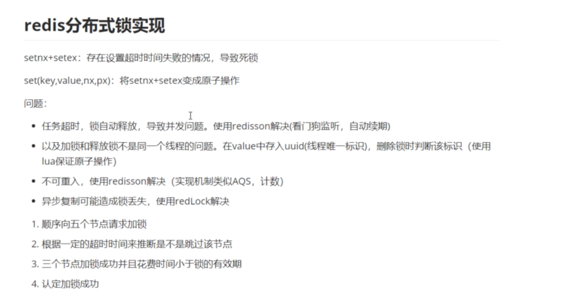

# 锁

> 不是很理解的地方都标红了

涉及到的线程安全问题：原子性、有序性、可见性。

Java中锁分两类：

1. 共享锁（也叫读锁），同一时刻允许多个线程抢占到锁
2. 排它锁（也叫写锁），同一时刻只允许一个线程访问共享资源

加锁会存在性能问题，性能和安全都要考虑到

1. 锁粒度的优化-->锁范围缩小（只锁需要的代码块）

2. ==无锁编程 --- (乐观锁)==;在不加锁的情况下保证安全性。比如CAS

   乐观锁认为读多写少，所以不会上锁。但是更新时会判断数据是否被更新，写时先读出当前版本号，比较和上一次的版本号是否一样，一样就表示期间没有被别人修改过，进行更新，不一样就重复上述步骤。

3. Synchronized：==偏向锁==（加锁的代码不存在竞争，为了安全性考虑。如果线程a过来时不存在竞争，就把锁偏向线程a，线程a下次过来的时候就不需要竞争锁）、==轻量级锁==（自旋锁，一直重试而不去阻塞影响性能，否则需要用户态和内核态之间的转换）、==重量级锁==

   自旋锁：如果持有锁的线程能在很短时间内释放锁，就可以用自旋锁。锁的自旋是要消耗cpu的，如果长时间处于cpu自旋，可以设置一个自旋最大等待时间，超过这个时间就将线程阻塞。（`自旋获取锁为什么不需要用户态和内核态的转换？也就是怎么获取锁的。`）自旋锁适用于“锁竞争不激烈，且会很快释放”的场景。

4. 读写锁（读多写少情况下），读和读不竞争，读和写、写和写竞争锁。

5. 公平锁、非公平锁（减少线程阻塞）

6. 悲观锁

   认为写多，并发写的可能性高，每次拿数据的时候都会认为别人会修改，所以每次读写的时候都会加锁。Synchronized就是悲观锁。

   `AQS框架下的锁则是先尝试cas乐观锁去获取锁，获取不到才会转换为悲观锁，如RetreenLock`

锁的特性：

1. 重入锁：当前线程拥有锁，在锁释放前又尝试获取锁，就直接次数+1，不需要竞争。为了安全性，防止死锁。
2. 分布式锁，进程间的锁

## Synchronized

### 锁膨胀

无锁->偏向锁->轻量级锁->重量级锁

起初是无锁状态，线程A进来就变成了偏向锁，偏向A，当线程A执行完，线程B进来，发现这个锁偏向A，不是偏向自己，锁升级为轻量级锁，线程B执行到一半，线程A来抢占锁，发现被B占用了，线程A进入自旋尝试，一直尝试到最大次数都没有获取到锁，这时候锁升级为重量级锁，线程A进入阻塞状态。

### 锁消除

编译期间的优化，如果某个场景不需要加锁，但是被程序员加锁了，那么编译期间这个锁会被去掉。（至于怎么判断是否需要用到锁，是逃逸分析技术得到的）。

### 锁粗化

由于锁的竞争和释放开销比较大，如果代码中对锁进行了频繁的竞争和释放，那么JVM会进行优化，将锁的范围适当扩大。


非公平锁：

- Synchronized
- ReentrantLock默认非公平锁
  - 可以通过构造方法传入true设置为公平锁

可重入锁：

- Synchronized
- ReentrantLock

悲观锁：

- Synchronized

自旋锁：

- Synchronized一开始是自旋锁，当变为重量级锁之后就不是自旋锁




synchronized不能解决分布式高并发问题。


使用redisson来实现分布式锁：

```java
public void takeStudents() {
  //1.获取锁对象
  //1.1获取锁的key，key由threadName和数据库ID组成
  String lockKey = Thread.currentThread().getName() + "";
  RLock lock = redissonClient.getLock("lockKey");
  try {
    //加锁，如果被其它线程锁住了，会等待其它线程释放。自己一直尝试加锁
    //如果加锁成功，会有个看门狗机制，定时循环延长锁的有效时间。循环间隔大概是执行业务的1/3时间
    lock.lock();
    //执行业务

  } finally {
    lock.unlock();
  }
}
```

lock方法中往下一直找可以找到lua脚本

lua脚本的意思是如果key存在就设置，过期时间。

```java
<T> RFuture<T> tryLockInnerAsync(long leaseTime, TimeUnit unit, long threadId, RedisStrictCommand<T> command) {
  internalLockLeaseTime = unit.toMillis(leaseTime);

  return evalWriteAsync(getName(), LongCodec.INSTANCE, command,
                        "if (redis.call('exists', KEYS[1]) == 0) then " +
                        "redis.call('hincrby', KEYS[1], ARGV[2], 1); " +
                        "redis.call('pexpire', KEYS[1], ARGV[1]); " +
                        "return nil; " +
                        "end; " +
                        "if (redis.call('hexists', KEYS[1], ARGV[2]) == 1) then " +
                        "redis.call('hincrby', KEYS[1], ARGV[2], 1); " +
                        "redis.call('pexpire', KEYS[1], ARGV[1]); " +
                        "return nil; " +
                        "end; " +
                        "return redis.call('pttl', KEYS[1]);",
                        Collections.singletonList(getName()), internalLockLeaseTime, getLockName(threadId));
}
```

再往前推一点可以看到看门狗机制，重新设置过期时间。

```java
protected RFuture<Boolean> renewExpirationAsync(long threadId) {
  return evalWriteAsync(getName(), LongCodec.INSTANCE, RedisCommands.EVAL_BOOLEAN,
                        "if (redis.call('hexists', KEYS[1], ARGV[2]) == 1) then " +
                        "redis.call('pexpire', KEYS[1], ARGV[1]); " +
                        "return 1; " +
                        "end; " +
                        "return 0;",
                        Collections.singletonList(getName()),
                        internalLockLeaseTime, getLockName(threadId));
}
```

有这样一个场景，我想从数据库中不断读取数据，将这些数据的某些字段修改。这个任务不止在一个pod上执行。

我们可以先确定数据从数据库中只取一次，这个可以每次取出一列数据时用主键排序，记录下当前最大的主键，当下次再去数据库中取数据时，只取大于当前最大值的数据。取出的数据交给线程池处理，线程池的拒绝策略为队列满时谁提交的线程就给谁处理。怎么保证多个pod之间不会处理到同一个数据，可以保证多个pod之间只有一个pod在执行这个任务。给执行任务的方法加分布式锁。可以添加自定义注解实现，实现方法是使用Aspect切面+redisson。


TreeSet

接口不可以有构造方法

xxljob定时任务
