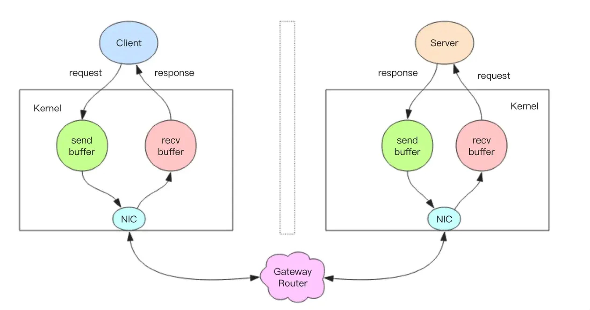

# Redis

## pipeline

1. 学习pipeline前先了解一下redis客户端怎么和服务端交互的

   服务端与客户端都是通过TCP长连接通信的，Redis在TCP上定义了一层RESP协议。

   客户端发送请求并监听Socket返回，服务端处理命令并将结果返回给客户端。

2. 为什么需要pipeline
   RTT：数据包从客户端发送到服务端，再从服务端返回到客户端。这一往返的时间叫做RTT（Round Trip Time）
   如果客户端要在一个批处理中执行多次请求，每次请求都是一个RTT，对性能影响非常大。所以需要一个新的技术改变。
   使得一次请求/响应能在未处理完的时候，让新的请求也能执行。这样就可以一次发送多个命令，客户端不需要等待服务端响应结果。pipeline是客户端和服务端共同实现的结果。
3. pipeline流程




- 客户端进程调用`write`将消息写到操作系统内核为套接字分配的发送缓冲`send buffer`。

- 客户端操作系统内核将发送缓冲的内容发送到网卡，网卡硬件将数据通过「网际路由」送到服务器的网卡。

- 服务器操作系统内核将网卡的数据放到内核为套接字分配的接收缓冲`recv buffer`。
- 服务器进程调用`read`从接收缓冲中取出消息进行处理。
- 服务器进程调用`write`将响应消息写到内核为套接字分配的发送缓冲`send buffer`。
- 服务器操作系统内核将发送缓冲的内容发送到网卡，网卡硬件将数据通过「网际路由」送到客户端的网卡。
- 客户端操作系统内核将网卡的数据放到内核为套接字分配的接收缓冲`recv buffer`。
- 客户端进程调用`read`从接收缓冲中取出消息返回给上层业务逻辑进行处理。

4. pipeline使用

   ```java
   @Autowired
   RedissonClient redissonClient;
   @GetMapping("/pipelined")
   public Result pipelined() throws ExecutionException, InterruptedException {
   
     RBatch batch = redissonClient.createBatch();
   // 1. 使用pipeline
     log.info("开始执行pipeline");
     long s1 = System.currentTimeMillis();
     for (int i = 0; i < 2000; i++) {
       batch.getBucket("mmm"+i).setAsync("nnn"+i);
     }
     batch.execute();
     long e1 = System.currentTimeMillis();
     log.info("pipeline执行结束，共"+(e1-s1)+"毫秒");
   
   // 2. 不使用pipeline，且同步
     log.info("不使用pipeline同步开始执行");
     long s2 = System.currentTimeMillis();
     for (int i = 0; i < 2000; i++) {
       redissonClient.getBucket("ooo"+i).set("ppp"+i);
     }
     long e2 = System.currentTimeMillis();
     log.info("不使用pipeline同步执行结束，共"+(e2-s2)+"毫秒");
   
   // 3. 不使用pipeline，且异步
     log.info("不使用pipeline异步开始执行");
     long s3 = System.currentTimeMillis();
     for (int i = 0; i < 2000; i++) {
       redissonClient.getBucket("qqq"+i).setAsync("rrr"+i);
     }
     long e3 = System.currentTimeMillis();
     log.info("不使用pipeline异步执行结束，共"+(e3-s3)+"毫秒");
     return Result.success();
   }
   ```

   下面的测试用的redis是部署在阿里云上的，所以肯定是有网络耗时的。

   ```bash
   循环2000次，一共有两千个指令，可以看出在2000次的情况下，redissonClient.getBucket().setAsync()是快于pipeline的。
   2024-03-03 19:18:30.635 开始执行pipeline
   2024-03-03 19:18:30.836 pipeline执行结束，共200毫秒
   2024-03-03 19:18:30.836 不使用pipeline同步开始执行
   2024-03-03 19:19:16.256 不使用pipeline同步执行结束，共45420毫秒
   2024-03-03 19:19:16.256 不使用pipeline异步开始执行
   2024-03-03 19:19:16.285 不使用pipeline异步执行结束，共28毫秒
   
   2024-03-03 19:20:26.502 开始执行pipeline
   2024-03-03 19:20:26.631 pipeline执行结束，共128毫秒
   2024-03-03 19:20:26.631 不使用pipeline同步开始执行
   2024-03-03 19:21:13.694 不使用pipeline同步执行结束，共47063毫秒
   2024-03-03 19:21:13.695 不使用pipeline异步开始执行
   2024-03-03 19:21:13.718 不使用pipeline异步执行结束，共23毫秒
   
   2024-03-03 19:21:50.847 开始执行pipeline
   2024-03-03 19:21:50.944 pipeline执行结束，共97毫秒
   2024-03-03 19:21:50.944 不使用pipeline同步开始执行
   2024-03-03 19:22:35.389 不使用pipeline同步执行结束，共44445毫秒
   2024-03-03 19:22:35.389 不使用pipeline异步开始执行
   2024-03-03 19:22:35.418 不使用pipeline异步执行结束，共29毫秒
   
   循环10000次查看redissonClient.getBucket().setAsync()和pipeline哪个快
   2024-03-03 19:27:32.235 开始执行pipeline
   2024-03-03 19:27:33.139 pipeline执行结束，共904毫秒
   2024-03-03 19:27:33.139 不使用pipeline异步开始执行
   2024-03-03 19:27:33.215 不使用pipeline异步执行结束，共76毫秒
   
   2024-03-03 19:27:59.735 开始执行pipeline
   2024-03-03 19:27:59.959 pipeline执行结束，共223毫秒
   2024-03-03 19:27:59.959 不使用pipeline异步开始执行
   2024-03-03 19:28:00.074 不使用pipeline异步执行结束，共115毫秒
   
   2024-03-03 19:28:28.710 开始执行pipeline
   2024-03-03 19:28:28.920 pipeline执行结束，共209毫秒
   2024-03-03 19:28:28.920 不使用pipeline异步开始执行
   2024-03-03 19:28:28.993 不使用pipeline异步执行结束，共73毫秒
   ```

5. 乱码问题

   自己配置一个RedissonClient并设置编码格式为StringCodec

   ```java
   @Bean
   RedissonClient redissonClient() {
       Config config = new Config();
       //必须设置redissonClient编码格式，否则存储到redis的时候会乱码
       config.setCodec(new StringCodec());
       config.useSingleServer().setAddress("redis://47.116.55.237:6379");
       return Redisson.create(config);
   }
   ```

   


> atention

- pipeline是非原子的，原生批量命令是原子的(mset，mget)
