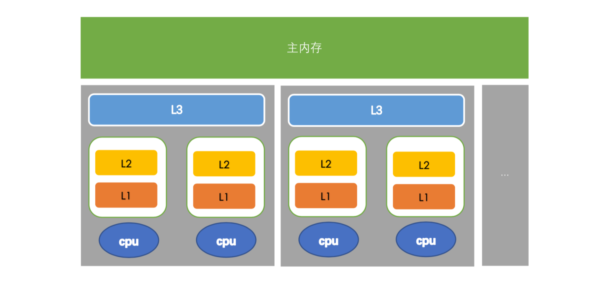
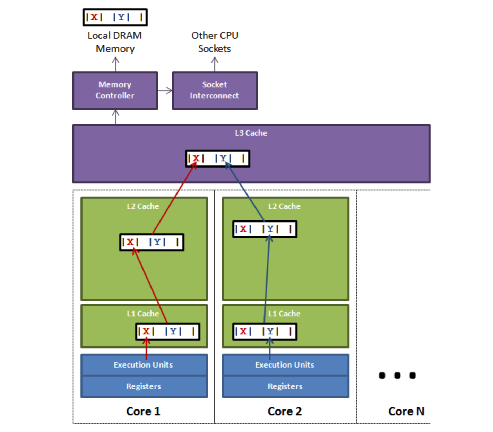

# Disruptor

JDK常见的线程安全队列

| 队列名                | 锁                    | 是否有界 |
| --------------------- | --------------------- | -------- |
| ArrayBlockingQueue    | 加锁（ReentrantLock） | 有界     |
| LinkedBlockingQueue   | 加锁（ReentrantLock） | 有界     |
| LinkedTransferQueue   | 无锁（CAS）           | 无界     |
| ConcurrentLinkedQueue | 无锁（CAS）           | 无界     |

jdk的这些队列要么加锁，要么无界，加锁导致性能很差，无界有内存溢出的风险。所以不建议使用jdk的线程安全队列。但是disruptor就不一样了，它无锁，有界，线程安全。

disruptor的无锁是利用cas实现的

disruptor一旦被shutdown是不能被重启的，如果要用必须新建一个disruptor并初始化。

并发编程框架，采用无锁编程思想 <a href="https://lmax-exchange.github.io/disruptor/user-guide/index.html">官网</a> 

1. 为什么需要Disruptor

   可以在异步事件处理中提供低延迟，高吞吐量的工作队列。

2. 核心概念

   - **Ring Buffer**
     - 存储和更新Event通过disruptor的数据
   - **Sequence**
     - 跟踪消费者和生产者进度，每个消费者都维护自己的Sequence。每个event进来都有自己的一个编号，这个编号就是sequence
   - **Sequencer**
     - disruptor的核心，该接口的两个实现（单生产者、多生产者）实现了所有并发算法，以便在生产者和消费者之间快速、正确地传递数据。
   - **Sequence Barrier**
     - 序列屏障，它是用于控制事件的发布和消费顺序的屏障
     - 消费者通过 Sequence 来表示自己已经处理的事件位置。Sequence Barrier 用于控制消费者可以读取的事件的范围。
     - Disruptor 提供了不同的 Sequence Barrier 实现，以支持不同的等待策略，如自旋等待、阻塞等待、超时等待等。
   - **Wait Strategy**
     - 消费者如何等待生产者将事件放入 Disruptor 中
   - Event
     - 从生产者传递到消费者的数据单位，由用户定义。
   - **Event Processor**
     - 它是Disruptor中的消费者，用于处理事件。每个消费者都会维护一个序列，表示它已经处理过的事件位置，消费者可以并行地处理事件。
   - **Event Handler**
     - 由用户实现的接口，代表Disruptor的消费者
   - **Producer**
     - 调用disruptor将事件排队的用户代码，这个概念在代码中没有体现。


## 使用

disruptor的bufferSize必须是2的n次幂，因为它是环形数组，环形数组在计算sequence是那个位置上的时候需要/数组大小，那么除以2的n次幂是不是就非常快，直接做&操作就可以了。

> 使用lambda使用disruptor

```java
import com.lmax.disruptor.RingBuffer;
import com.lmax.disruptor.dsl.Disruptor;
import com.lmax.disruptor.util.DaemonThreadFactory;

import java.nio.ByteBuffer;

public class LongEventMain {
    public static void main(String[] args) throws InterruptedException {
        int bufferSize = 16;
        Disruptor<LongEvent> disruptor = new Disruptor<>(LongEvent::new, bufferSize, DaemonThreadFactory.INSTANCE);
        disruptor.handleEventsWith(((event, sequence, endOfBatch) -> {
            //处理事件
            System.out.println("longEvent1 = " + event + ", sequence = " + sequence + ", endOfBatch = " + endOfBatch);
        }));
        disruptor.start();
        RingBuffer<LongEvent> ringBuffer = disruptor.getRingBuffer();
        ByteBuffer bb = ByteBuffer.allocate(8);

        for (int i = 0; true; i++) {
            bb.putLong(0, i);
            ringBuffer.publishEvent((event, sequence, buffer) -> event.setLongValue(buffer.getLong(0)), bb);
            Thread.sleep(1000);
            if (i == 1000) break;
        }
      	disruptor.shutdown();
    }
}
```

> 不使用lambda使用disruptor

定义事件

```java
public class LongEvent {
    private long longValue;

    public void setLongValue(long longValue) {
        this.longValue = longValue;
    }

    @Override
    public String toString() {
        return "LongEvent{" +
                "longValue=" + longValue +
                '}';
    }
}
```

定义事件工厂

```java
public class LongEventFactory implements EventFactory<LongEvent> {
    @Override
    public LongEvent newInstance() {
        return new LongEvent();
    }
}
```

定义消费者

```java
public class LongEventHandler implements EventHandler<LongEvent> {
    @Override
    public void onEvent(LongEvent longEvent, long l, boolean b) {
        System.out.println("longEvent = " + longEvent + ", l = " + l + ", b = " + b);
    }
}
```

Disruptor 提供了许多不同的接口（`EventTranslator`、`EventTranslatorOneArg`、`EventTranslatorTwoArg`等），可以实现这些接口来提供翻译器。这是为了允许将翻译器表示为静态类和 lambda（参见[上文](https://lmax-exchange.github.io/disruptor/user-guide/index.html#publishing-using-lambdas)）。翻译方法的参数通过对环形缓冲区的调用传递给翻译器。

定义翻译器

```java
public class MyEventTranslateOneArg implements EventTranslatorOneArg<LongEvent,Long> {
    @Override
    public void translateTo(LongEvent event, long sequence, Long arg0) {
        event.setLongValue(arg0);
    }
}
```

main方法

```java
public static void main(String[] args) throws InterruptedException {
    int bufferSize = 16;
    Disruptor<LongEvent> disruptor = new Disruptor<>(new LongEventFactory(), bufferSize, DaemonThreadFactory.INSTANCE);
    disruptor.handleEventsWith(new LongEventHandler());
    disruptor.start();

    RingBuffer<LongEvent> ringBuffer = disruptor.getRingBuffer();
    ByteBuffer bb = ByteBuffer.allocate(8);
    long b;
    for (int i = 0; true; i++) {
        b = i;
        ringBuffer.publishEvent(new MyEventTranslateOneArg(), b);
      	Thread.sleep(1000);
      	if (i == 1000) break;
    }
}
```

可以看到上述代码没有使用lambda，新增了很多类。但是这样更容易理解各个类之间的关系。

### disruptor的shutdown()

disruptor在shutdown的时候要注意，生产者线程已经结束，处于*TERMINATED*状态，这时候才能shutdown。

```java
//shutdown之前要保证生产者所在的线程不再生产了。
while (producerThread.isAlive()) {
    if (producerThread.isDaemon()) {
        disruptor.shutdown();
        break;
    }
}
```


### Wait Strategies等待策略

什么是等待策略？

- 当读追上写的时候，读会等待，这时候就需要等待策略了。同样的道理写追上读的时候也需要等待策略。

默认的等待策略是`BlockingWaitStrategy`。`BlockingWaitStrategy`是可用等待策略中最慢的，但在 CPU 使用率方面是最保守的，并且将在最广泛的部署选项中提供最一致的行为。

- **BlockingWaitStrategy**
  - 阻塞等待，当消费者没有可消费的事件时，一直阻塞等待。
- **SleepingWaitStrategy**
  - 休眠等待，当消费者没有可消费的事件时，定期进入休眠，然后检查是否有新的事件等待消费。
  - 它在不需要低延迟但希望对生产线程影响较小的情况下效果最佳。一个常见的用例是异步日志记录。
- **YieldingWaitStrategy**
  - 让步等待策略，在消费者没有可用事件时，会调用线程的 yield() 方法，将 CPU 时间让给其他线程。这种策略可以减少资源占用，并且具有一定的自旋效果，但也可能会导致 CPU 自旋消耗较高。
  - 当您需要非常高的性能并且`EventHandler`线程数低于逻辑核心总数（例如启用了超线程）时，这是推荐的等待策略。
- **BusySpinWaitStrategy**
  - 忙等待策略，在消费者没有可用事件时，会进行自旋等待，不进行休眠或让步。这种策略可以实现最低的延迟，但也会持续消耗 CPU 资源。
  - 仅当线程数量`EventHandler`低于机器上的物理核心数量时才应使用此等待策略，例如应禁用超线程。

### 单/多生产者

提高并发系统性能的最佳方法之一是遵循单写入器原则，适用于disruptor。disruptor的单生产者效率比多生产者高。

多个生产者一个消费者

```java
public static void main(String[] args) {
    int bufferSize = 16;
    Disruptor<UserEvent> disruptor = new Disruptor<>(UserEvent::new, bufferSize, DaemonThreadFactory.INSTANCE, ProducerType.MULTI, new BlockingWaitStrategy());
    disruptor.handleEventsWith(new UserEventHandler());
    disruptor.start();

    RingBuffer<UserEvent> ringBuffer = disruptor.getRingBuffer();
    String username1 = "zhangsan";
    Integer age1 = 23;
    Integer age2 = 24;
    String username2 = "lisi";

    Thread thread = new Thread(() -> {
        try {
            for (int i = 0; i < 30; i++) {
                ringBuffer.publishEvent(new UserEventTranslateTwoArg(), username1, age1);
                Thread.sleep(1);
            }
        } catch (InterruptedException e) {
            throw new RuntimeException(e);
        }
    });

    thread.start();
    for (int i = 0; true; i++) {
        ringBuffer.publishEvent(((event, sequence, arg0, arg1) -> {
            event.setUsername(arg0);
            event.setAge(arg1);
        }), username2, age2);
        if (i == 50) break;
    }
    //shutdown之前要保证生产者所在的线程不再生产了。
    while (thread.isAlive()) {
        if (thread.isDaemon()) {
            disruptor.shutdown();
            break;
        }
    }
}
```

### 一个生产者多个消费者

```java
//两个消费者是都处理，来一个event，handler1和handler2都会处理。
disruptor.handleEventsWith(new UserEventHandler(),new UserEventHandler());
//输出，同一个sequence会被两个handler都执行，可以在两个handler中做不同的事情。两个handler是没有执行顺序的。
/*
userEvent = UserEvent{username='zhangsan', age=23}, sequence = 0, endOfBatch = true
userEvent = UserEvent{username='zhangsan', age=23}, sequence = 0, endOfBatch = true
userEvent = UserEvent{username='zhangsan', age=23}, sequence = 1, endOfBatch = true
userEvent = UserEvent{username='zhangsan', age=23}, sequence = 1, endOfBatch = true
userEvent = UserEvent{username='zhangsan', age=23}, sequence = 2, endOfBatch = true
userEvent = UserEvent{username='zhangsan', age=23}, sequence = 2, endOfBatch = true
*/

//调用then方法，可以让后一个handler在执行某个sequence的时候在自己之后执行。
disruptor.handleEventsWith(((event, sequence, endOfBatch) -> System.out.println("1" + event.getAge())))
                .then((event, sequence, endOfBatch) -> System.out.println("2" + event.getAge()));
//每个sequence中必须在1和3都处理完后才能处理2
disruptor.handleEventsWith(new MyEventHandler("1"),new MyEventHandler("3"))
                .then(new MyEventHandler("2"));
//每个事件将仅由其中一个工作处理程序处理
disruptor.handleEventsWithWorkerPool(
        (event -> System.out.println("work1: "+event.getAge())),
        (event -> System.out.println("work2: "+event.getAge()))
);
//上述输出
/*
work1: 0
work2: 1
work2: 3
work2: 4
work2: 5
work2: 6
work2: 7
work1: 2
work1: 9
work2: 8
*/
```

可以将handleEventsWith和then一起组合使用，这样就可以灵活的使用disruptor消费event。

after方法中只能存放已经定义好的且被加入消费者的handler。

```java
MyEventHandler handler1 = new MyEventHandler("1");
        MyEventHandler handler2 = new MyEventHandler("2");
        disruptor.handleEventsWith(handler1);
        disruptor.handleEventsWith(handler2);

        disruptor.after(handler1,handler2).handleEventsWith(((event, sequence, endOfBatch) -> System.out.println("3: "+event.getAge())));
```


### 伪共享

#### CPU读取数据的过程



1. 硬件：一个计算机有一个主内存，一个处理器对应一个物理插槽，一个插槽对应一个L3 Cache，一个L3 Cache对应多个cpu，一个cpu有一个寄存器，一个L1 Cache、一个L2 Cache。
2. cpu读取数据过程：cpu读取数据的时候，先看L1有没有，如果没有再看L2，L3有没有，如果都没有再去主内存获取。越靠近cpu执行速度越快。当一个线程对数据操作完之后，要把数据写回主内存，另一个线程通过主内存获取数据。

#### 缓存失效及disruptor伪共享




cpu读取数据的时候都是一个缓存行一个缓存行读取的，一读读一行，每个缓存行大小是32~128字节（通常是64字节），一个long是8个字节，8个long正好一个缓存行。

上述图片是disruptor伪共享图。此图展示了一个槽，多个cpu。其中cpu1中的线程更新了X，根据MESI协议，变量X的所在的所有缓存行都会失效。由于变量X和Y在同一个缓存行，那么Y也会失效。cpu2中的线程发现Y失效，会往上一层一层查找，直到找到没有失效的，如果都失效了，会从主内存中获取。（为什么不直接从主内存中获取呢？cpu1中的线程更新完了，任意一个其它线程来读取X，那么X的值就会往下一个一个缓存行中更新，使被更新的缓存行生效）。由于两个变量之间共享一个缓存行而引发的问题，这就是伪共享。

