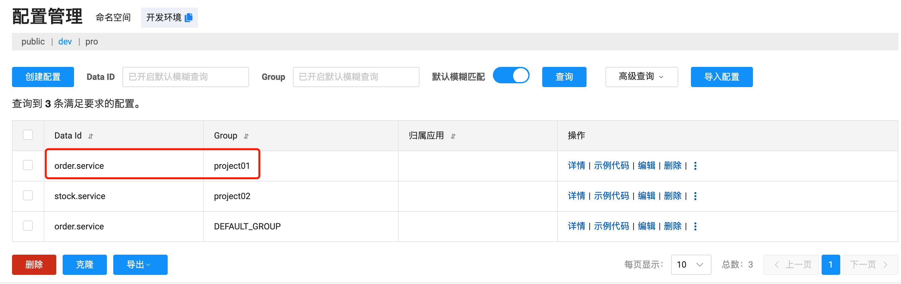

# Nacos

<a href="https://nacos.io/zh-cn/docs/what-is-nacos.html">官网</a> 

1. 什么是Nacos

   注册中心+配置中心+服务管理的平台

2. Nacos的特点

   **服务发现和服务健康监测**、**动态配置服务**、**动态 DNS 服务**、**服务及其元数据管理**

## 流程

nacos中维护了一个mysql的表

| id   | server-name   | ip           | port | status |
| ---- | ------------- | ------------ | ---- | ------ |
| 1    | order-service | 192.168.1.12 | 8081 | up     |
| 2    | stock-service | 192.168.7.10 | 8082 | up     |

服务注册：当订单服务启动时，会向nacos注册（相当于insert一条数据），同样库存服务启动时也会向nacos注册一条记录，包含自己的服务名、ip和端口号等。

服务发现：订单服务想发起请求时，会从nacos中获取到可请求的服务。（nacos中服务如果增加了也会自动被发现）

服务会隔几秒发送一个请求到nacos表示自己还在，如果超过一定时间会将对应服务的status设置为down，如果时间太长会直接删除这条记录，相当于服务下线。同样的如果服务shutdown了，会调用nacos提供的方法，清除服务并删除记录。

当订单服务调用库存服务时，不是每次都去nacos的数据库中查找有哪些服务，他会把服务信息存储到本地redis中，方便以后调用。(定时的调用服务获取接口更新redis中的缓存)

备注：服务发现是指客户端从注册中心中查找和选择可用的服务实例，并通过负载均衡策略来分配请求。


nacos配置文件中可以设置数据库的地址，如果不设置数据库，默认用内存存储服务信息。

`application.yml配置`

```yml
server:
  port: 8082

spring:
  cloud:
    nacos:
      server-addr: localhost:8848
      username: nacos
      password: nacos
      discovery:
        namespace: e580be43-9b9b-44e1-a367-06d7baeff51c
  application:
    name: stock-service
```

## 举例

服务之间的调用

如果我有订单服务和库存服务，订单服务调用库存服务，如下

```java
@RestController
@RequestMapping("/order")
public class OrderController {
    @Autowired
    RestTemplate restTemplate;

    @GetMapping("/stock")
    public String replace() {
        ResponseEntity<String> response = restTemplate.exchange("http://stock-service/stock/deduct", HttpMethod.GET, null, String.class);
        return "Hello "+response.getBody();
    }
}
```

其中的restTemplate配置如下，如果不加@LoadBalanced就不会调用到库存服务

```java
@SpringBootConfiguration
public class SpringConfig {
    @LoadBalanced
    @Bean
    public RestTemplate restTemplate(RestTemplateBuilder builder) {
        RestTemplate build = builder.build();
        return build;
    }
}
```

订单服务的application.yml

```yml
server:
  port: 8083
spring:
  cloud:
    nacos:
      discovery:
        ip: localhost
        port: 8848
        namespace: e580be43-9b9b-44e1-a367-06d7baeff51c
        username: nacos
        password: nacos

  application:
    name: order-service
```


库存服务

```java
@RestController
@RequestMapping("/stock")
public class StockController {

    @GetMapping("/deduct")
    public String deduct() {
        System.out.println("扣减库存成功");
        return "扣减库存成功";
    }
}
```

库存服务的application.yml

```yml
server:
  port: 8082
spring:
  cloud:
    nacos:
      server-addr: localhost:8848
      username: nacos
      password: nacos
      discovery:
        namespace: e580be43-9b9b-44e1-a367-06d7baeff51c
  application:
    name: stock-service
```

然后两个服务就可以通过RestTemplate调用了。


## 服务详情

1. 临时实例
   - 服务注册到nacos后，如果宕机或者关闭了，过30s左右会在nacos列表中删除
2. 永久实例
   - 服务注册到nacos后，如果宕机，或者被手动停止服务了，在nacos中不会剔除改服务，只会将健康状态更新为false
3. 保护阈值：设置0-1之间（一般不用nacos的，都用sentinel）
   - 如果健康实例数/(健康实例数+不健康实例数) < 保护阈值，那么就会触发保护机制，请求也会被打到不健康的实例上去。

## 服务搭建

nacos默认数据源是存储在内存中，如果要搭建集群的nacos是要把数据源更换为mysql的。

集群搭建：

1. 修改每个nacos中的application.properties配置、clustr.conf配置
2. 如果有内存不足的错误可以修改startup.sh脚本编辑内存容量
3. 配置nginx进行反向代理

## 负载均衡Ribbon

负载方案：

- 集中式负载均衡：在消费者和服务提供者之间使用独立的方式进行负载，比如F5(硬件)、Nginx(软件)
- 客户端负载均衡：客户端根据自己的请求情况做负载均衡。`个人理解(比如上次请求的服务响应时间长了，下次就请求另一个响应时间短的服务器)`

Ribbon就是客户端负载均衡

nacos-discovery已经依赖了ribbon的jar包，如果引入了nacos-discovery那么就不需要再引入ribbon。使用方法就是在RestTemplate的bean上加@LoadBalance注解、默认的负载均衡策略是ZoneAvoidanceRule。

### 负载均衡策略

顶级接口IRule，实现了IRule的都是负载均衡策略。

- RandomRule：随机
- RoundRobinRule：轮询
- RetryRule：重试+轮询
- WeightedResponseTimeRule+权重
- BestAvailableRule：过滤失效服务实例功能，找出并发请求最小服务实例调用
- ZoneAvoidanceRule：默认规则，复合判断server所在区域的性能和server的可用性选择服务器，如果没有区域概念会采用RoundRobinRule进行轮询。
- AvailabilityFilteringRule：先过滤掉故障实例，再选择并发较小的实例

​	

## 配置说明

一般用命名空间给环境分类，group给项目进行分类，dataid对应每个微服务，正常情况下dataId就是微服务的名称。（dataId+group组合是唯一的）

看每个公司自己的业务情况。

关于config配置使用bootstrap配置文件，而不是application

file-extention需要指定文件类型


### 基本使用

导入依赖：

```xml
<dependency>
    <groupId>com.alibaba.cloud</groupId>
    <artifactId>spring-cloud-starter-alibaba-nacos-config</artifactId>
</dependency>
```

```yaml
spring:
  application:
    name: order.service
  cloud:
    nacos:
      server-addr: 47.116.55.237:8848
      config:
        namespace: 63341642-206d-45fd-8502-277c9e0c5579
        file-extension: yaml
        group: project01
```

对应到nacos的控制台



对应到代码上面，不断输出配置，期间修改nacos中的值，查看变化，发现会随着nacos的变化而变化。

```java
@SpringBootApplication
@EnableFeignClients
public class OrderApplication {
    public static void main(String[] args) throws InterruptedException {
        SpringApplication springApplication = new SpringApplication(OrderApplication.class);
        ConfigurableApplicationContext applicationContext = springApplication.run(args);
        while (true) {
            System.out.println(applicationContext.getEnvironment().getProperty("user.name"));
            System.out.println(applicationContext.getEnvironment().getProperty("user.age"));
            Thread.sleep(2000);
        }
    }
}
```

查看日志很重要，可以看出这个组件的执行流程


### 自动刷新配置

很奇怪，它又可以了。可能和版本有关，把版本号放在这

```xml
<dependencyManagement>
    <dependencies>
        <dependency>
            <groupId>org.springframework.boot</groupId>
            <artifactId>spring-boot-dependencies</artifactId>
            <version>2.3.12.RELEASE</version>
            <type>pom</type>
            <scope>import</scope>
        </dependency>
        <dependency>
            <groupId>com.alibaba.cloud</groupId>
            <artifactId>spring-cloud-alibaba-dependencies</artifactId>
            <version>2.2.0.RELEASE</version>
            <type>pom</type>
            <scope>import</scope>
        </dependency>
        <dependency>
            <groupId>org.springframework.cloud</groupId>
            <artifactId>spring-cloud-dependencies</artifactId>
            <version>Hoxton.SR8</version>
            <type>pom</type>
            <scope>import</scope>
        </dependency>
    </dependencies>
</dependencyManagement>
```

用ConfigurationProperties什么都不用写，就会自动刷新配置。

```java
@Configuration
@ConfigurationProperties(prefix = "user")
@Data
public class UserConfig {
    String name;
}
```

使用@Value注解，要在类上添加@RefreshScope才会自动刷新配置。

```java
@Configuration
@RefreshScope
@Data
public class UserConfig {
    @Value("${user.name}")
    String name;
}
```

### 多环境

比如原来的配置文件

```yaml
spring:
  application:
    name: order.service
  cloud:
    nacos:
      server-addr: 47.116.55.237:8848
      config:
        namespace: 63341642-206d-45fd-8502-277c9e0c5579
        file-extension: yaml
        group: project01
```

```shell
# 启动项目输出日志
2024-08-16 16:21:50.528  WARN 34745 --- [           main] c.a.c.n.c.NacosPropertySourceBuilder     : 
Ignore the empty nacos configuration and get it based on dataId[order.service.yaml] & group[project01]

2024-08-16 16:21:50.529  INFO 34745 --- [           main] b.c.PropertySourceBootstrapConfiguration : 
Located property source: [BootstrapPropertySource {name='bootstrapProperties-order.service.yaml,project01'}, BootstrapPropertySource {name='bootstrapProperties-order.service,project01'}]

2024-08-16 16:21:50.534  INFO 34745 --- [           main] com.van.OrderApplication                 : 
No active profile set, falling back to default profiles: default
```

可以看到dataId[order.service.yaml] & group[project01]，和 No active profile set。可以添加profile设置环境。

配置文件添加

```yaml
spring:
	profiles:
    active: dev
```

我们的启动日志又变了,如下的dataId[order.service.yaml] & group[project01] 和 dataId[order.service-dev.yaml] & group[project01]。其中profile的配置文件，文件名在nacos的服务端中必须写全，后缀名必须加上。如下图xxx-dev.yaml

```shell
2024-08-16 16:24:54.232  WARN 34798 --- [           main] c.a.c.n.c.NacosPropertySourceBuilder     : 
Ignore the empty nacos configuration and get it based on dataId[order.service.yaml] & group[project01]

2024-08-16 16:24:54.261  WARN 34798 --- [           main] c.a.c.n.c.NacosPropertySourceBuilder     : 
Ignore the empty nacos configuration and get it based on dataId[order.service-dev.yaml] & group[project01]

2024-08-16 16:24:54.262  INFO 34798 --- [           main] b.c.PropertySourceBootstrapConfiguration : 
Located property source: [BootstrapPropertySource {name='bootstrapProperties-order.service-dev.yaml,project01'}, BootstrapPropertySource {name='bootstrapProperties-order.service.yaml,project01'}, BootstrapPropertySource {name='bootstrapProperties-order.service,project01'}]

2024-08-16 16:24:54.272  INFO 34798 --- [           main] com.van.OrderApplication                 : 
The following profiles are active: dev
```


### 多配置文件（自定义dataId）

一般dataId默认都是和服务名相同，但是如果需要多个配置文件也可以，nacos有开放这个设置。nacos服务端中自定义的dataId可以随意设置但是必须包含后缀名。如下的order.service2.yaml，group也可以随意设置。


然后在bootstrap中添加extension-configs配置,或者shared-configs也可以。

```yaml
spring:
  application:
    name: order.service
  cloud:
    nacos:
      server-addr: 47.116.55.237:8848
      config:
        namespace: 63341642-206d-45fd-8502-277c9e0c5579
        file-extension: yaml
        group: project01
        # 下面这个配置就是新建的自定义的配置文件，refresh在自定义dataId这里是默认关闭的
        extension-configs:
          - data-id: order.service2.yaml
            group: DEFAULT_GROUP
            refresh: true
```

### 优先级

环境配置 > 默认配置 > 自定义dataId配置（extention > shared）

众所周知springboot配置文件的优先级是后读取到的优先，看启动日志

```bash
2024-08-16 17:16:02.257  INFO 35871 --- [           main] b.c.PropertySourceBootstrapConfiguration : Located property source: [BootstrapPropertySource {name='bootstrapProperties-order.service-dev.yaml,project01'}, BootstrapPropertySource {name='bootstrapProperties-order.service.yaml,project01'}, BootstrapPropertySource {name='bootstrapProperties-order.service,project01'}, BootstrapPropertySource {name='bootstrapProperties-order.service2.yaml,DEFAULT_GROUP'}]
```

这里的Located property source应该是按照优先级从高到低输出的

order.service-dev.yaml,project01

order.service.yaml,project01

order.service,project01

order.service2.yaml,DEFAULT_GROUP


> 备注

默认根据服务名读取

nacos客户端默认读取properties配置文件，如果服务端改成yaml格式，那么就拉取不到配置了，除非file-extention被设置为yaml。
