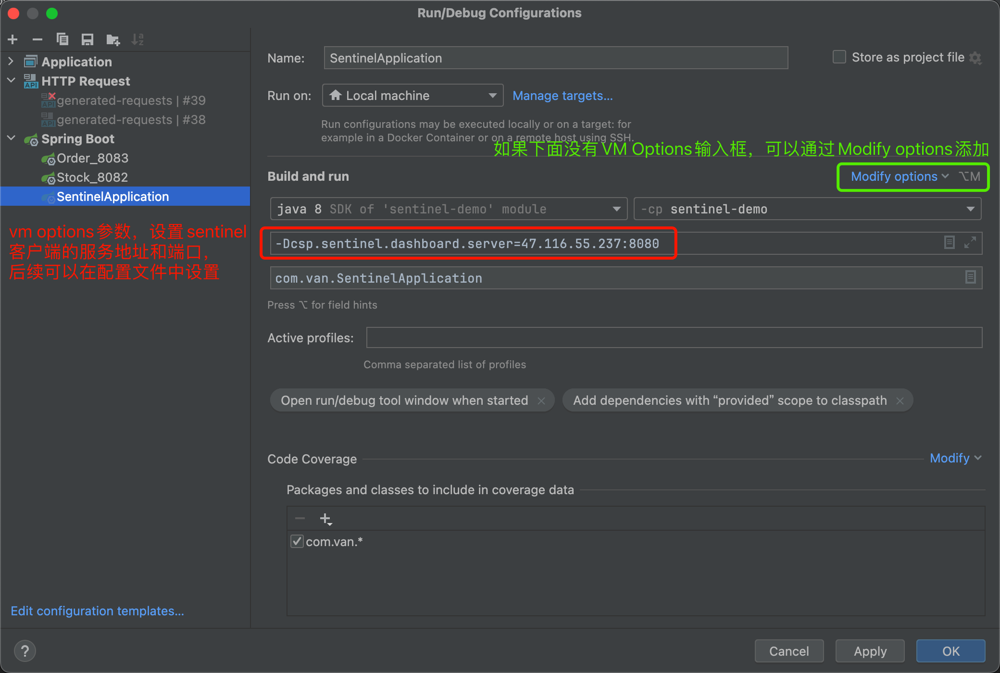
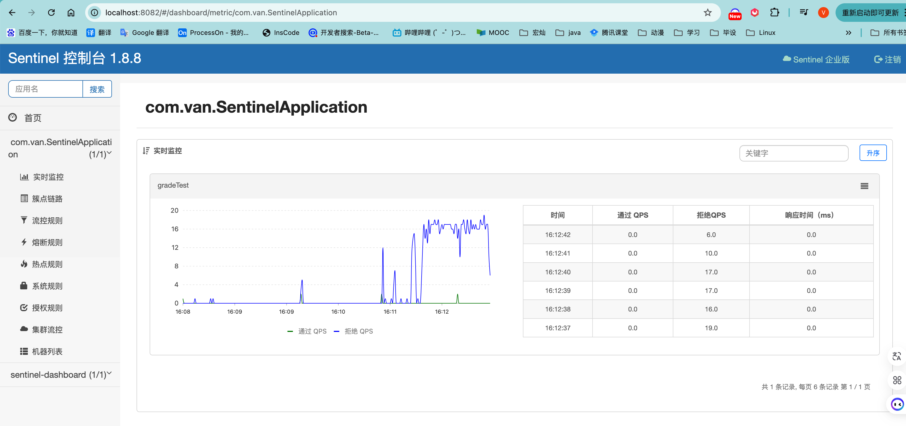
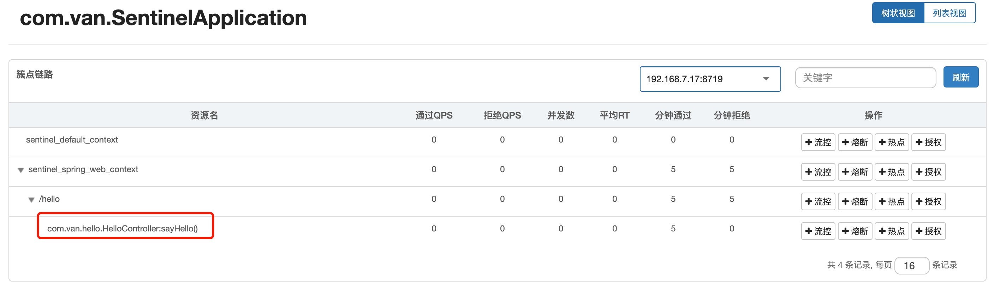
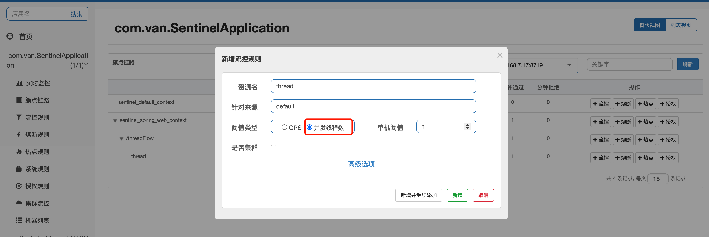
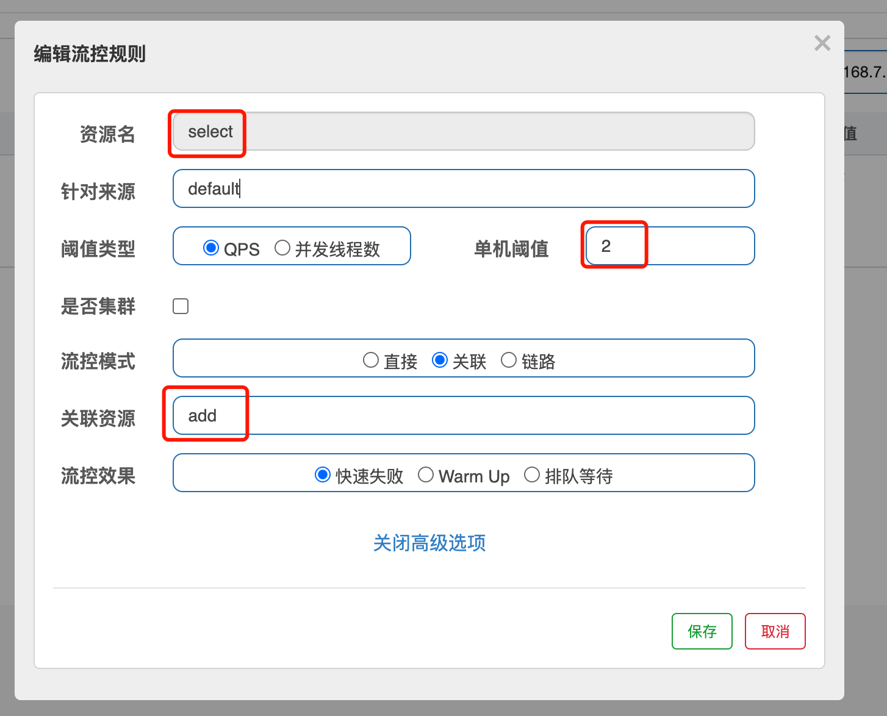

# Alibaba Sentinel

服务宕机原因可能有哪些：硬件不够，磁盘空间不足，激增流量，打满线程池，db超时，异常未处理，缓存击穿，缓存穿透，缓存雪崩，服务雪崩，负载不均衡。

## 三个缓存问题：

缓存击穿：（击穿针对某个key）

- redis中没有这个key，db有，在key失效的瞬间有大量针对这个key的请求打到db上。（这个key是个热点key）
- 解决方案：
  - get key的时候如果为null，加上lock，数据库中查询出来，释放锁。其他线程此时如果在获取锁失败，就睡眠100ms后重试。
  - 当缓存失效时，不是立即load db，而是先用setnx这种带有是否成功的返回值，当返回成功时再load db。
  - 设置永不过期的key

缓存穿透：（穿透针对数据库没有的数据）

- 请求一个数据库中没有的数据，那么缓存中肯定也没有，所以每次请求都会打到db上。
- 解决方案：
  - 布隆过滤器

缓存雪崩：（雪崩针对大量key）

- 大量的缓存同一时间失效，导致大量请求打到db。
- 解决方案：
  - 设置过期时间分布的合理性
  - 在每次快过期前，执行定时任务设置key，并更新过期时间。

## 服务问题

### 服务雪崩

1. 什么是服务雪崩？

   从出现问题的那个服务开始积压请求然后挂掉，往上一个一个积压，一个一个挂掉。就是雪崩。

2. 解决方案

   - 常见的容错机制
     - 超时机制
     - 服务限流，nginx、mq、sentinel都可以实现
     - 隔离
       - 通过线程池隔离，限制每个服务的线程访问量
       - 通过信号量隔离，根据信号量大小去请求线程。
     - 服务熔断

## Sentinel

开源的sentinel够中小型企业用的了，不过alibaba还提供了一套企业版收费的sentinel，也可以自己扩展sentinel。

Hystrix和Sentinel一样也是一个防护组建。Hystrix是Netflix的组件。

### 根据官网实现限流的一个例子：

导入依赖

```xml
<dependencies>
  <dependency>
    <groupId>org.springframework.boot</groupId>
    <artifactId>spring-boot-starter-web</artifactId>
  </dependency>
  <!--sentinel不需要spring cloud，在springboot-web中就能使用-->
  <dependency>
    <groupId>com.alibaba.csp</groupId>
    <artifactId>sentinel-core</artifactId>
  </dependency>
  <dependency>
    <groupId>com.alibaba.csp</groupId>
    <artifactId>sentinel-annotation-aspectj</artifactId>
  </dependency>
  <dependency>
    <groupId>org.projectlombok</groupId>
    <artifactId>lombok</artifactId>
  </dependency>
</dependencies>
```

controller层

```java
@RestController
@Slf4j
public class HelloController {
    public static final String RESOURCE_NAME = "say";
    private static final String USER_RESOURCE_NAME = "user";
    @GetMapping("/say")
    public String hello() {
        Entry entry = null;
        try {
            entry = SphU.entry(RESOURCE_NAME);
            String str = "hello word";
            log.info("==="+str+"===");
            return str;
        } catch (BlockException e) {
            log.info("block");
            return "被限流了";
        } finally {
            if (entry != null) {
                entry.exit();
            }
        }
    }


    /**
     * 定义规则
     */
    @PostConstruct
    public static void initFlowRules() {
        ArrayList<FlowRule> rules = new ArrayList<>();
        FlowRule rule = new FlowRule();
        rule.setResource(RESOURCE_NAME);
        rule.setGrade(RuleConstant.FLOW_GRADE_QPS);
        //QPS并发量设置为1,测试的时候可以用apifox并发请求。
        rule.setCount(1);
        rules.add(rule);
        FlowRuleManager.loadRules(rules);
    }
}
```

### 使用@SentinelResource注解

使用这个注解也得定义规则，规则也可以在控制台设置。

在配置类中还要添加一个Bean

```java
@Bean
public SentinelResourceAspect sentinelResourceAspect() {
    return new SentinelResourceAspect();
}
```

```java
@RestController
@Slf4j
public class HelloController {
    private static final String HELLO_RESOURCE_NAME = "hello";


    /**
     * blockHandler 设置异常方法，默认必须写在接口所在的类中。
     *              必须是public
     *              返回值和愿方法必须和源方法一样
     *              请求参数和源方法必须一致，可以在最后添加BlockException的参数
     *              BlockException
     *                  FlowException 流控异常
     *                  DegradeException 降级异常
     *                  AuthorityException
     *                  SystemBlockException
     * blockHandlerClass 设置BlockException异常方法所在的类（如果不想让其和源方法在同一个类中）
     * fallback 当接口出现异常，可以交给fallback定义的方法处理。同blockHandler一样，返回类型，请求参数都要一致，请求参数最后一个可以是Throwable参数
     * fallbackClass 同blockHandlerClass
     * 注意blockHandler处理的是BlockException异常
     * 如果同时满足流控和异常，流控的优先级高于异常。
     *
     * @return
     */
    @SentinelResource(value = HELLO_RESOURCE_NAME,blockHandler = "exceptionFlow")
    @GetMapping("/hello")
    public String hello1(@RequestParam("id") String id) {
        return "hello1";
    }


    /**
     * 定义规则
     */
    @PostConstruct
    public static void initFlowRules() {
        ArrayList<FlowRule> rules = new ArrayList<>();
        FlowRule rule = new FlowRule();
        rule.setResource(HELLO_RESOURCE_NAME);
        rule.setGrade(RuleConstant.FLOW_GRADE_QPS);
        //QPS并发量设置为1,测试的时候可以用apifox并发请求。
        rule.setCount(1);
        rules.add(rule);
        FlowRuleManager.loadRules(rules);
    }

    public String exceptionFlow(String id,BlockException blockException) {
        log.info("exception block");
        return "block";
    }
}
```


Rule：

限流规则（FlowRule）、降级规则（DegradeRule）、SystemRule、AuthorityRule

## sentinel控制台

### 控制台部署

<a href="https://sentinelguard.io/zh-cn/docs/dashboard.html">sentinel官网</a>

控制台是一个单独的jar包，需要去官网下载后启动

```shell
[root@iZuf6fju7z3m5dvq5s4i9yZ ~]# ps -ef |grep jar
root     11136 11116  0 15:28 pts/0    00:00:00 grep --color=auto jar
root     14659     1  0 Sep23 ?        02:01:30 java -Dserver.port=8080 -Dcsp.sentinel.dashboard.server=127.0.0.1:8080 -Dproject.name=sentinel-dashboard -Dsentinel.dashboard.auth.username=van -Dsentinel.dashboard.auth.password=liujian -jar sentinel-dashboard-1.8.8.jar

# 用的启动命令就是java -Dserver.port=8080 -Dcsp.sentinel.dashboard.server=127.0.0.1:8080 -Dproject.name=sentinel-dashboard -Dsentinel.dashboard.auth.username=van -Dsentinel.dashboard.auth.password=liujian -jar sentinel-dashboard-1.8.8.jar
# 我这个控制台部署在服务器上，设置了登录账号van，密码liujian
```

控制台部署完毕可以通过浏览器查看http://47.116.55.237:8080/

### 服务连接到控制台

1. 微服务连接到控制台需要添加pom

```xml
<dependency>
  <groupId>com.alibaba.csp</groupId>
  <artifactId>sentinel-transport-simple-http</artifactId>
</dependency>
```

2. VM Options添加参数

一开始启动在控制台中不会显示服务的信息，需要请求对应地址后才会显示。



通过控制台设置的流控规则默认不会持久化，也就是说下次启动服务的时候流控规则不在了。




## 整合springCloudAlibaba

> pom文件

```xml
<!--包含了控制台和sentinel的其他基本功能-->
<dependency>
  <groupId>com.alibaba.cloud</groupId>
  <artifactId>spring-cloud-starter-alibaba-sentinel</artifactId>
</dependency>
```

> yaml文件：配置控制台的地址

```yaml
spring:
  cloud:
    sentinel:
      transport:
        dashboard: 47.116.55.237:8080
```

## 基本使用

### 流控规则

@SentinelResource注解中如果未设置value值，那么在控制台中默认会用全限定名来定义名称

```java
@GetMapping("/hello")
@SentinelResource(blockHandler = "sayHello2")
public String sayHello() {
  return "hello";
}
public String sayHello2(BlockException e) {
  return "sayHello被流控了";
}
```

如下，在/hello上添加流控是没有效果的，只有添加在sayHello方法上才可以。如果定义了@SentinelResource的value，那么会在下面显示对应的value而不是方法全名，在value上添加流控即可。



1. QPS流控

   每秒最大请求数，超过了就进行流控

2. 线程数流控`一般都会在tomcat进行线程流控`

   当前服务器中处理对应资源的最大线程数。如果超过了就会进行流控。

   ```java
   @GetMapping("/threadFlow")
   @SentinelResource(value = "thread",blockHandler = "thread",blockHandlerClass = SentinelBlockExceptionHandler.class)
   public String thread() throws InterruptedException {
       TimeUnit.SECONDS.sleep(5);
       return "正常执行";
   }
   ```

   给thread添加线程数流控

   


### 统一异常处理

如果每个流控返回的内容不一样，还是不建议使用它的统一异常处理的。

代码处理：去掉SentinelResource注解

```java
@GetMapping("/hello")
public String sayHello() {
  return "hello";
}
```

添加统一异常类,实现BlockExceptionHandler接口

```java
@Component
public class SentinelGlobalException implements BlockExceptionHandler {

    @Override
    public void handle(HttpServletRequest request, HttpServletResponse response, BlockException e) throws Exception {

        if (e instanceof FlowException) {
            response.getOutputStream().write("FlowException occur".getBytes());
        } else if (e instanceof DegradeException) {
            response.getOutputStream().write("DegradeException occur".getBytes());
        }
    }
}
```

在控制台添加流控规则，然后调试就可以了。


### 流控模式

1. 直接

   访问资源a，那么只会对资源a有影响

2. 关联

   访问资源a，对资源b有影响。比如下单的时候，由于下单压力太大，把查询订单给流控了。

   如下图，当我访问add超过了每秒2次的时候，我在这期间访问select资源是会被流控的。流控到select的blockHandler方法上。

   

   

3. 链路


