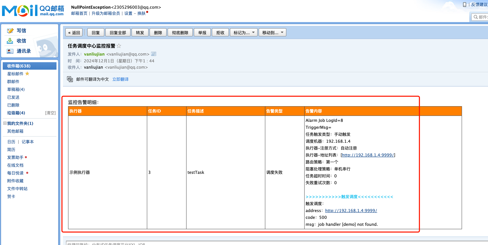

# xxl-job

<a href="https://www.xuxueli.com/xxl-job/">官方文档</a>

部署后访问地址：http://localhost:8080/xxl-job-admin

账号：admin/123456


## 配置告警邮箱

```properties
### xxl-job, email
spring.mail.host=smtp.qq.com
spring.mail.port=465
spring.mail.username=vanliujian@qq.com
spring.mail.from=vanliujian@qq.com
# 第三方授权码
spring.mail.password=diddjpotclaqdijc
spring.mail.properties.mail.smtp.auth=true
spring.mail.properties.mail.smtp.starttls.enable=true
spring.mail.properties.mail.smtp.starttls.required=true
spring.mail.properties.mail.smtp.socketFactory.class=javax.net.ssl.SSLSocketFactory
```

配置完成执行任务，如果有问题会发给报警邮箱




## 执行原理：

1. 调度中心和执行器通信

   xxljob维护了一张表xxl_job_registry，存储了执行器的信息。一旦执行器下线，就会删掉对应那条数据。和nacos服务一样，调度中心会定时向执行器发送探活接口。执行器也会定时发送心跳到调度中心。

   ```mysql
   CREATE TABLE `xxl_job_registry` (
     `id` int NOT NULL AUTO_INCREMENT,
     `registry_group` varchar(50) NOT NULL,
     `registry_key` varchar(255) NOT NULL,
     `registry_value` varchar(255) NOT NULL,
     `update_time` datetime DEFAULT NULL,
     PRIMARY KEY (`id`),
     KEY `i_g_k_v` (`registry_group`,`registry_key`,`registry_value`)
   ) ENGINE=InnoDB AUTO_INCREMENT=4 DEFAULT CHARSET=utf8mb4 COLLATE=utf8mb4_0900_ai_ci;
   ```

2. 如何定时触发任务？

   xxl-job有如下这张表，其中trigger_next_time保存的就是下次调度的时间戳。

   trigger_next_time在每次执行后都会更新一次

   ```mysql
   CREATE TABLE `xxl_job_info` (
     `id` int NOT NULL AUTO_INCREMENT,
     `job_group` int NOT NULL COMMENT '执行器主键ID',
     `job_desc` varchar(255) NOT NULL,
     `add_time` datetime DEFAULT NULL,
     `update_time` datetime DEFAULT NULL,
     `author` varchar(64) DEFAULT NULL COMMENT '作者',
     `alarm_email` varchar(255) DEFAULT NULL COMMENT '报警邮件',
     `schedule_type` varchar(50) NOT NULL DEFAULT 'NONE' COMMENT '调度类型',
     `schedule_conf` varchar(128) DEFAULT NULL COMMENT '调度配置，值含义取决于调度类型',
     `misfire_strategy` varchar(50) NOT NULL DEFAULT 'DO_NOTHING' COMMENT '调度过期策略',
     `executor_route_strategy` varchar(50) DEFAULT NULL COMMENT '执行器路由策略',
     `executor_handler` varchar(255) DEFAULT NULL COMMENT '执行器任务handler',
     `executor_param` varchar(512) DEFAULT NULL COMMENT '执行器任务参数',
     `executor_block_strategy` varchar(50) DEFAULT NULL COMMENT '阻塞处理策略',
     `executor_timeout` int NOT NULL DEFAULT '0' COMMENT '任务执行超时时间，单位秒',
     `executor_fail_retry_count` int NOT NULL DEFAULT '0' COMMENT '失败重试次数',
     `glue_type` varchar(50) NOT NULL COMMENT 'GLUE类型',
     `glue_source` mediumtext COMMENT 'GLUE源代码',
     `glue_remark` varchar(128) DEFAULT NULL COMMENT 'GLUE备注',
     `glue_updatetime` datetime DEFAULT NULL COMMENT 'GLUE更新时间',
     `child_jobid` varchar(255) DEFAULT NULL COMMENT '子任务ID，多个逗号分隔',
     `trigger_status` tinyint NOT NULL DEFAULT '0' COMMENT '调度状态：0-停止，1-运行',
     `trigger_last_time` bigint NOT NULL DEFAULT '0' COMMENT '上次调度时间',
     `trigger_next_time` bigint NOT NULL DEFAULT '0' COMMENT '下次调度时间',
     PRIMARY KEY (`id`)
   ) ENGINE=InnoDB AUTO_INCREMENT=4 DEFAULT CHARSET=utf8mb4 COLLATE=utf8mb4_0900_ai_ci;
   ```

   

