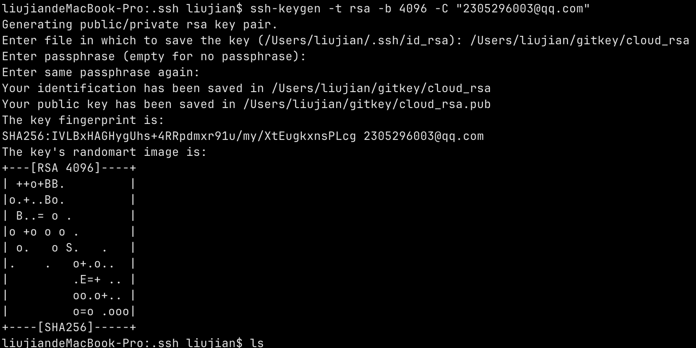
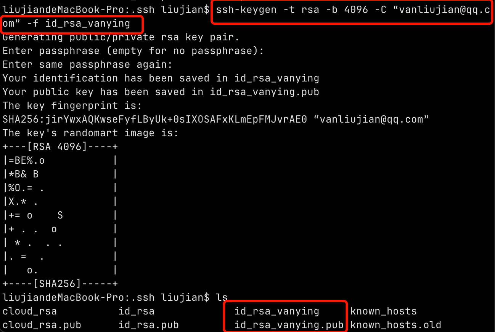
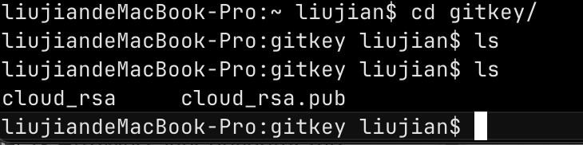
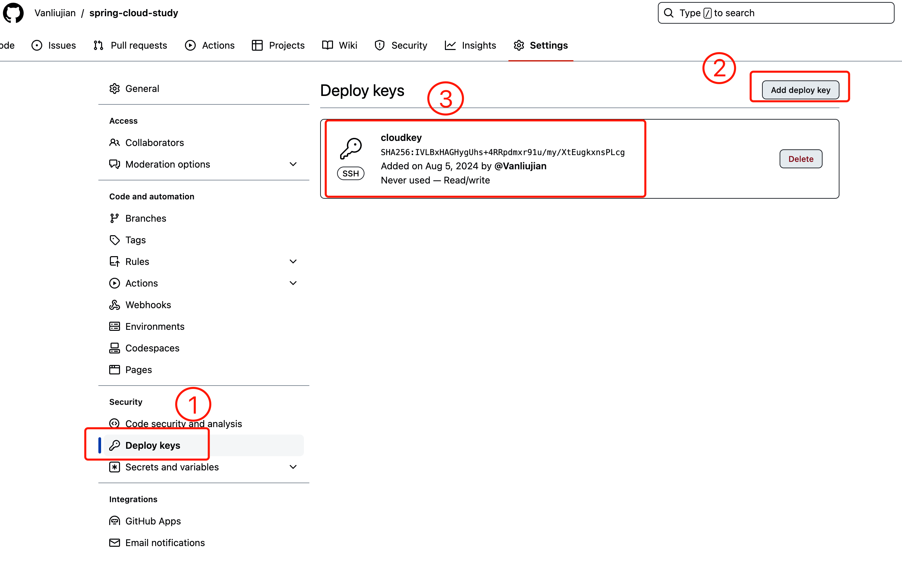

- 把枚举作为int类型存入数据库，controller接收的时候可以作为枚举接收，传入的是枚举的字符串。
- redis的监听事件是否合理？什么时候可以用？
  - 在写会议提前30min通知的时候想到的，创建会议时添加key并设置过期时间，过期时触发通知动作。
  - 如果隔几秒扫描一次数据库判断是否是前30min的话，会增加数据库压力。
  - 不知道究竟该如何做，怎样做性能才会更好？
- 此mac设置redis在后台运行，redis-server --daemonize yes
  - 在配置文件中设置此属性并不生效。

- list去重可以直接new ArrayList<>(new LinkedHashSet<>(list));

> Git配置push权限

首先在本地生成密钥文件：



可以输入保存位置同时重命名，也可以添加-f参数，设置名称为其他名称。



自动生成两个文件



cloud_rsa是私钥，pub结尾的是公钥，将公钥内容复制到github上。



还需要再将私钥添加到ssh代理中

```bash
liujiandeMacBook-Pro:spring-cloud-study liujian$ eval "$(ssh-agent -s)"
Agent pid 88118
liujiandeMacBook-Pro:spring-cloud-study liujian$ ssh-add ~/.ssh/cloud_rsa
Identity added: /Users/liujian/.ssh/cloud_rsa (2305296003@qq.com)
liujiandeMacBook-Pro:spring-cloud-study liujian$ ls
README.md order     pom.xml
liujiandeMacBook-Pro:spring-cloud-study liujian$ git push
Enumerating objects: 11, done.
Counting objects: 100% (11/11), done.
Delta compression using up to 4 threads
Compressing objects: 100% (10/10), done.
Writing objects: 100% (10/10), 1.99 KiB | 1.99 MiB/s, done.
Total 10 (delta 0), reused 0 (delta 0), pack-reused 0
To github.com:Vanliujian/spring-cloud-study.git
   2f60d88..3653355  main -> main
liujiandeMacBook-Pro:spring-cloud-study liujian$
```

ssh-add -l 查看当前 ssh-agent 中加载的所有密钥

```bash
liujiandeMacBook-Pro:.ssh liujian$ ssh-add -l
4096 SHA256:jirYwxAQKwseFyfLByUk+0sIXOSAFxKLmEpFMJvrAE0 “vanliujian@qq.com” (RSA)
```


