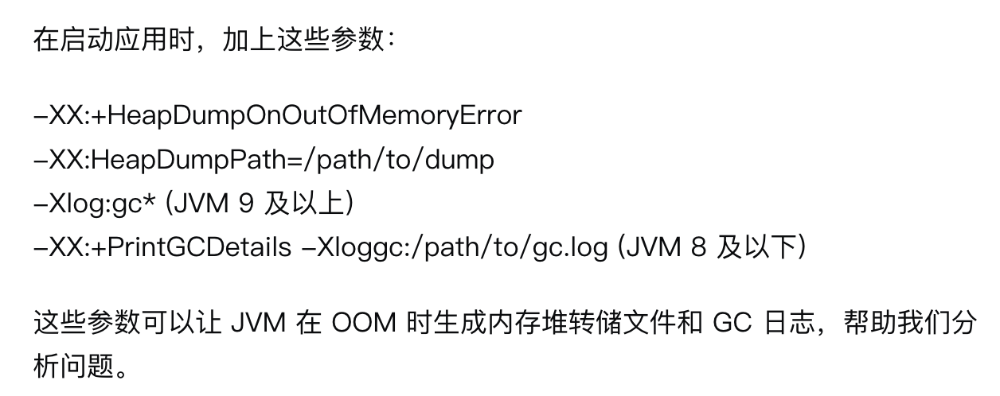

## 1. 使用OpenFeign调用第三方接口

```java
@FeignClient(value = "testFeignClient", url = "https://ip:443/dataex/api", configuration = ServiceFeignConfiguration.class)
public interface TestFeignClient {

    /**
     * 获取十天内的天气
     * @param tenWeatherRequestBody
     * @param appKey
     * @param appSecret
     * @param timestamp
     * @param signature
     * @return
     */
    @PostMapping("/aaa")
    @Headers("Content-Type: application/json")
    JSONObject getTen(@RequestBody TenWeatherRequestBody tenWeatherRequestBody, @RequestParam("appKey") String appKey,
                                    @RequestParam("appSecret") String appSecret, @RequestParam("timestamp") String timestamp,
                                    @RequestParam("signature") String signature);
}
```

## 2. 忽略ssl证书认证

```java
import feign.Client;

import javax.net.ssl.SSLContext;
import javax.net.ssl.TrustManager;
import javax.net.ssl.X509TrustManager;
import java.security.cert.CertificateException;
import java.security.cert.X509Certificate;


public class IgnoreFeignHttpsSSLClient {
    public Client feignClient() {
        try {
            SSLContext ctx = SSLContext.getInstance("SSL");
            X509TrustManager tm = new X509TrustManager() {
                @Override
                public void checkClientTrusted(X509Certificate[] chain,String authType) throws CertificateException {
                }

                @Override
                public void checkServerTrusted(X509Certificate[] chain,String authType) throws CertificateException {
                }

                @Override
                public X509Certificate[] getAcceptedIssuers() {
                    return null;
                }
            };
            ctx.init(null, new TrustManager[]{tm}, null);
            return new Client.Default(ctx.getSocketFactory(), (hostname, session) -> true);
        } catch (Exception e) {
            return null;
        }
    }
}
```

> 配置类添加

注意此配置类不能加@Configuration注解，除非你想让他全局生效。

```java
public class ServiceFeignConfiguration {

    // 加载自定义Client
    @Bean("generateClient")
    public Client generateClient() {
        return new IgnoreFeignHttpsSSLClient().feignClient();
    }

}
```

使用的时候在FeignClient中配置configuration为当前配置类ServiceFeignConfiguration.class就行。

## 3. 获取视频时长(推荐用Xuggler)

1. 使用FFmeg包，但是打成的jar包有200多M

   ```xml
   <dependency>
       <groupId>ws.schild</groupId>
       <artifactId>jave-all-deps</artifactId>
       <version>3.3.1</version>
   </dependency>
   ```

   ```java
   /**
        * 获取视频时长，单位/s
        * @param file
        * @return
        * @throws IOException
        * @throws EncoderException
        */
   @Override
   public String getDuration(MultipartFile file) throws IOException, EncoderException {
     String name = file.getOriginalFilename();
     File tempFile = new File(file.getOriginalFilename());
     FileUtils.copyInputStreamToFile(file.getInputStream(), tempFile);
     MultimediaObject multimediaObject = new MultimediaObject(tempFile);
     // 获取媒体对象的信息对象
     MultimediaInfo info = multimediaObject.getInfo();
     // 从媒体信息对象中获取媒体的时长，单位是：ms
     long duration = info.getDuration();
     String duraStr = FileFormatter.formatDuration(duration);
     // 删除临时文件
     tempFile.delete();
     return duraStr;
   }
   ```

2. `使用Xuggler，jar包没有那么大`

   ```xml
   <dependency>
       <groupId>com.xuggle</groupId>
       <artifactId>xuggle-xuggler</artifactId>
       <version>5.4</version>
   </dependency>
   ```

   ```java
   /**
      * Xuggler库获取时长 单位/s
      * @param file
      * @return
      * @throws IOException
      */
   @Override
   public String getDurationByXuggler(MultipartFile file) throws IOException {
     File tempVideo = File.createTempFile("video", null);
     try (FileOutputStream outputStream = new FileOutputStream(tempVideo)){
       outputStream.write(file.getBytes());
     }
     IContainer container = IContainer.make();
     if (container.open(tempVideo.getAbsolutePath(), IContainer.Type.READ,null) < 0) {
       //不是视频、音频格式 或者是不支持的格式返回空字符串
       return "";
     }
     long duration = container.getDuration();
     tempVideo.deleteOnExit();
     return FileFormatter.formatDuration(duration/1000);
   }
   ```

   > 注意点

   - 如果在上传文件的接口中获取时长，注意不要将原来的MultiPartFile进行transferTo，transferTo是将原来的文件内容剪切到新的，原来的文件内容就没有了。可以通过createTempFile创建临时文件，再通过流写入临时文件。对临时文件进行操作就不会对接下来操作有影响。


4. 音频转文字

- 调用腾讯的api
  - 创建音频转写任务
  - 查询音频转写任务结果

创建音频转写任务响应：

```json
{
    "log_id": "17285312675921246",
    "task_status": "Created",
    "task_id": "67074b4307d1bb000102fc7b"
}
```

查询结果返回的响应：

```json
{
    "log_id": "17285313094384331",
    "tasks_info": [
        {
            "task_status": "Success",
            "task_result": {
                "result": [
                    "嗯嗯嗯。我问为什么那女孩传简讯给我。而你为什么不解释低着头沉默。该相信你很爱我，不愿意敷衍我，还是明白你不想我嗯。那谁呢嗯？什么为什么不在胜利的？属于什么体格？然后说我从长长城将拖着把爱都走去整。重重要的是男人真心再次落落，让对比失去难受，我怀念的是无话可说，我怀念的是一起走过，我怀念的是争吵以后还是想要爱你，我记得那边的时候也记得那一首歌。记得那天胸口最近那样说，最暖的胸口，谁记得嗯？谁说呢嗯？想为什么我不再是你的快乐是为什么却苦笑说我都懂得自尊上上将人拖着，爱走走走走走走，起床了起是吧？真想太赤裸，真的你吃清淡的说我不要。那个呱呱不说我怀念的一起做噩梦，不过面的山茶余淮还是山羊，爱你爱你无动静，那英率爱情，那与帅哥并很大的胸口，自己的忧伤怎样的胸口，谁忘了怀念着树根感动？我怀念的是得一句人，我怀念的你很激动求我原谅我的，阻止你的在北国警花中毒着举着举着手表井内的烟花，这裙子想有谁爱的，哎呦，谁把我吓晕了谁呀？我希望你们家几几几几几几几几希望我等着，我希望北京西装，希望交给你，无语，那你说啊啊啊啊啊啊啊啊啊！我还想要爱你大知道我爱那样深爱一进那一首歌，记得那片星空，静静的忧伤，紧张的胸口，哦，忘了说。我不认真嗯，这样子拖拖。谁都我都不舍得再买了？所以我嗯。没有哭没有说。嗯。"
                ],
                "audio_duration": 289066,
                "detailed_result": [
                    {
                        "res": [
                            "嗯嗯嗯。"
                        ],
                        "end_time": 3320,
                        "begin_time": 360,
                        "words_info": [],
                        "sn": "58139684521728531284",
                        "corpus_no": "7423985335521706065"
                    },
                    {
                        "res": [
                            "我问为什么那女孩传简讯给我。"
                        ],
                        "end_time": 23145,
                        "begin_time": 17100,
                        "words_info": [],
                        "sn": "973241204681728531284",
                        "corpus_no": "7423985336065622101"
                    },
                    {
                        "res": [
                            "而你为什么不解释低着头沉默。"
                        ],
                        "end_time": 30540,
                        "begin_time": 24600,
                        "words_info": [],
                        "sn": "339372453371728531284",
                        "corpus_no": "7423985336328508553"
                    },
                    {
                        "res": [
                            "该相信你很爱我，不愿意敷衍我，还是明白你不想我嗯。"
                        ],
                        "end_time": 41160,
                        "begin_time": 30760,
                        "words_info": [],
                        "sn": "889453086551728531284",
                        "corpus_no": "7423985336066123948"
                    },
                    {
                        "res": [
                            "那谁呢嗯？"
                        ],
                        "end_time": 44905,
                        "begin_time": 41560,
                        "words_info": [],
                        "sn": "831712890601728531284",
                        "corpus_no": "7423985336133822772"
                    },
                    {
                        "res": [
                            "什么为什么不在胜利的？"
                        ],
                        "end_time": 52085,
                        "begin_time": 45560,
                        "words_info": [],
                        "sn": "500873373661728531284",
                        "corpus_no": "7423985336201212176"
                    },
                    {
                        "res": [
                            "属于什么体格？"
                        ],
                        "end_time": 55820,
                        "begin_time": 53260,
                        "words_info": [],
                        "sn": "950342508281728531284",
                        "corpus_no": "7423985336187244266"
                    },
                    {
                        "res": [
                            "然后说我从长长城将拖着把爱都走去整。"
                        ],
                        "end_time": 65920,
                        "begin_time": 56000,
                        "words_info": [],
                        "sn": "894745183991728531284",
                        "corpus_no": "7423985336313425800"
                    },
                    {
                        "res": [
                            "重重要的是男人真心再次落落，让对比失去难受，我怀念的是无话可说，我怀念的是一起走过，我怀念的是争吵以后还是想要爱你，我记得那边的时候也记得那一首歌。"
                        ],
                        "end_time": 77660,
                        "begin_time": 66440,
                        "words_info": [],
                        "sn": "69595535041728531284",
                        "corpus_no": "7423985335664158680"
                    },
                    {
                        "res": [
                            "记得那天胸口最近那样说，最暖的胸口，谁记得嗯？"
                        ],
                        "end_time": 102280,
                        "begin_time": 95160,
                        "words_info": [],
                        "sn": "233516291641728531284",
                        "corpus_no": "7423985336247305264"
                    },
                    {
                        "res": [
                            "谁说呢嗯？"
                        ],
                        "end_time": 111780,
                        "begin_time": 103960,
                        "words_info": [],
                        "sn": "300006422171728531284",
                        "corpus_no": "7423985336293472091"
                    },
                    {
                        "res": [
                            "想为什么我不再是你的快乐是为什么却苦笑说我都懂得自尊上上将人拖着，爱走走走走走走，起床了起是吧？真想太赤裸，真的你吃清淡的说我不要。"
                        ],
                        "end_time": 127840,
                        "begin_time": 114940,
                        "words_info": [],
                        "sn": "399959959681728531284",
                        "corpus_no": "7423985340517180341"
                    },
                    {
                        "res": [
                            "那个呱呱不说我怀念的一起做噩梦，不过面的山茶余淮还是山羊，爱你爱你无动静，那英率爱情，那与帅哥并很大的胸口，自己的忧伤怎样的胸口，谁忘了怀念着树根感动？"
                        ],
                        "end_time": 155840,
                        "begin_time": 145020,
                        "words_info": [],
                        "sn": "957801216411728531285",
                        "corpus_no": "7423985340501516125"
                    },
                    {
                        "res": [
                            "我怀念的是得一句人，我怀念的你很激动求我原谅我的，阻止你的在北国警花中毒着举着举着手表井内的烟花，这裙子想有谁爱的，哎呦，谁把我吓晕了谁呀？"
                        ],
                        "end_time": 187440,
                        "begin_time": 175420,
                        "words_info": [],
                        "sn": "454034610411728531285",
                        "corpus_no": "7423985340584986307"
                    },
                    {
                        "res": [
                            "我希望你们家几几几几几几几几希望我等着，我希望北京西装，希望交给你，无语，那你说啊啊啊啊啊啊啊啊啊！"
                        ],
                        "end_time": 217640,
                        "begin_time": 205420,
                        "words_info": [],
                        "sn": "518235122711728531285",
                        "corpus_no": "7423985340575308396"
                    },
                    {
                        "res": [
                            "我还想要爱你大知道我爱那样深爱一进那一首歌，记得那片星空，静静的忧伤，紧张的胸口，哦，忘了说。"
                        ],
                        "end_time": 246940,
                        "begin_time": 235500,
                        "words_info": [],
                        "sn": "453485695271728531285",
                        "corpus_no": "7423985340479419189"
                    },
                    {
                        "res": [
                            "我不认真嗯，这样子拖拖。"
                        ],
                        "end_time": 261480,
                        "begin_time": 259240,
                        "words_info": [],
                        "sn": "828276920511728531285",
                        "corpus_no": "7423985340591864596"
                    },
                    {
                        "res": [
                            "谁都我都不舍得再买了？所以我嗯。"
                        ],
                        "end_time": 274400,
                        "begin_time": 264620,
                        "words_info": [],
                        "sn": "346256031631728531285",
                        "corpus_no": "7423985340459311317"
                    },
                    {
                        "res": [
                            "没有哭没有说。"
                        ],
                        "end_time": 282000,
                        "begin_time": 276080,
                        "words_info": [],
                        "sn": "651977929731728531285",
                        "corpus_no": "7423985340535093965"
                    },
                    {
                        "res": [
                            "嗯。"
                        ],
                        "end_time": 283640,
                        "begin_time": 282640,
                        "words_info": [],
                        "sn": "952096320151728531285",
                        "corpus_no": "7423985340493052419"
                    }
                ],
                "corpus_no": "7423985335521706065"
            },
            "task_id": "67074b4307d1bb000102fc7b"
        }
    ]
}
```


# 监控JVM信息

编写sh文件

```sh
# 设置环境变量
export PATH=/usr/local/sbin:/usr/local/bin:/sbin:/bin:/usr/sbin:/usr/bin

# 设置日志文件路径
LOGFILE="/data/soft/qpty/stack/logfile.log"

# 获取目标Java应用的PID
TARGET_PID=$(/opt/soft/jdk17/jdk-17.0.12/bin/jps | grep ruoyi-modules-flat.jar | awk '{print $1}')

# 检查是否找到了目标Java进程
if [ -z "$TARGET_PID" ]; then
  echo "$(date '+%Y-%m-%d %H:%M:%S') - Error: Could not find the target Java application." >> $LOGFILE
else
  # 输出当前时间戳和分隔线
  echo "$(date '+%Y-%m-%d %H:%M:%S') ====================" >> $LOGFILE

  # 执行jstat命令并附加输出到日志文件，每行都加上时间戳
 /opt/soft/jdk17/jdk-17.0.12/bin/jstat -gc $TARGET_PID | while IFS= read -r line; do
    echo "$(date '+%Y-%m-%d %H:%M:%S') $line" >> $LOGFILE
  done
fi
```

设置crontab命令

```shell
crontab -e
# 然后输入*/1 * * * * /data/soft/qpty/stack/flat_jvm.sh >> /data/soft/qpty/stack/flat_logfile.log 2>&1
# 表示一分钟执行一次sh命令
```

最终会得倒一个logfile.log文件，内容大概如下：

```log
2025-03-20 22:00:01 ====================
2025-03-20 22:00:01     S0C         S1C         S0U         S1U          EC           EU           OC           OU          MC         MU       CCSC      CCSU     YGC     YGCT     FGC    FGCT     CGC    CGCT       GCT   
2025-03-20 22:00:01         0.0      8192.0         0.0      8192.0     136192.0      33792.0     117760.0      89068.0    97216.0    96597.3   12160.0   11833.5     42     0.594     0     0.000     6     0.011     0.604
2025-03-20 22:01:02 ====================
2025-03-20 22:01:02     S0C         S1C         S0U         S1U          EC           EU           OC           OU          MC         MU       CCSC      CCSU     YGC     YGCT     FGC    FGCT     CGC    CGCT       GCT   
2025-03-20 22:01:02         0.0      8192.0         0.0      8192.0     136192.0      37888.0     117760.0      89068.0    97216.0    96597.3   12160.0   11833.5     42     0.594     0     0.000     6     0.011     0.604
2025-03-20 22:02:01 ====================
2025-03-20 22:02:01     S0C         S1C         S0U         S1U          EC           EU           OC           OU          MC         MU       CCSC      CCSU     YGC     YGCT     FGC    FGCT     CGC    CGCT       GCT   
2025-03-20 22:02:01         0.0      8192.0         0.0      8192.0     136192.0      39936.0     117760.0      89068.0    97216.0    96597.3   12160.0   11833.5     42     0.594     0     0.000     6     0.011     0.604
2025-03-20 22:03:01 ====================
2025-03-20 22:03:01     S0C         S1C         S0U         S1U          EC           EU           OC           OU          MC         MU       CCSC      CCSU     YGC     YGCT     FGC    FGCT     CGC    CGCT       GCT   
2025-03-20 22:03:02         0.0      8192.0         0.0      8192.0     136192.0      43008.0     117760.0      89068.0    97216.0    96597.3   12160.0   11833.5     42     0.594     0     0.000     6     0.011     0.604
2025-03-20 22:04:01 ====================
2025-03-20 22:04:01     S0C         S1C         S0U         S1U          EC           EU           OC           OU          MC         MU       CCSC      CCSU     YGC     YGCT     FGC    FGCT     CGC    CGCT       GCT   
2025-03-20 22:04:01         0.0      8192.0         0.0      8192.0     136192.0      46080.0     117760.0      89068.0    97216.0    96597.3   12160.0   11833.5     42     0.594     0     0.000     6     0.011     0.604
2025-03-20 22:05:01 ====================
2025-03-20 22:05:01     S0C         S1C         S0U         S1U          EC           EU           OC           OU          MC         MU       CCSC      CCSU     YGC     YGCT     FGC    FGCT     CGC    CGCT       GCT   
2025-03-20 22:05:01         0.0      8192.0         0.0      8192.0     136192.0      49152.0     117760.0      89068.0    97216.0    96597.3   12160.0   11833.5     42     0.594     0     0.000     6     0.011     0.604
2025-03-20 22:06:01 ====================
2025-03-20 22:06:02     S0C         S1C         S0U         S1U          EC           EU           OC           OU          MC         MU       CCSC      CCSU     YGC     YGCT     FGC    FGCT     CGC    CGCT       GCT   
2025-03-20 22:06:02         0.0      8192.0         0.0      8192.0     136192.0      52224.0     117760.0      89068.0    97216.0    96597.3   12160.0   11833.5     42     0.594     0     0.000     6     0.011     0.604
2025-03-20 22:07:01 ====================
2025-03-20 22:07:01     S0C         S1C         S0U         S1U          EC           EU           OC           OU          MC         MU       CCSC      CCSU     YGC     YGCT     FGC    FGCT     CGC    CGCT       GCT   
2025-03-20 22:07:01         0.0      8192.0         0.0      8192.0     136192.0      54272.0     117760.0      89068.0    97216.0    96597.3   12160.0   11833.5     42     0.594     0     0.000     6     0.011     0.604
2025-03-20 22:08:01 ====================
2025-03-20 22:08:01     S0C         S1C         S0U         S1U          EC           EU           OC           OU          MC         MU       CCSC      CCSU     YGC     YGCT     FGC    FGCT     CGC    CGCT       GCT   
2025-03-20 22:08:01         0.0      8192.0         0.0      8192.0     136192.0      57344.0     117760.0      89068.0    97216.0    96597.3   12160.0   11833.5     42     0.594     0     0.000     6     0.011     0.604
2025-03-20 22:09:02 ====================
2025-03-20 22:09:02     S0C         S1C         S0U         S1U          EC           EU           OC           OU          MC         MU       CCSC      CCSU     YGC     YGCT     FGC    FGCT     CGC    CGCT       GCT   
2025-03-20 22:09:02         0.0      8192.0         0.0      8192.0     136192.0      60416.0     117760.0      89068.0    97216.0    96597.3   12160.0   11833.5     42     0.594     0     0.000     6     0.011     0.604
```

# JVM监控

上述只是查看gc情况，应该看dump文件来排查。dump文件生成后用mat分析

启动应用时加上两个参数，前两个就可以

-XX:+HeapDumpOnOutOfMemoryError

-XX:HeapDumpPath=/path/to/dump



