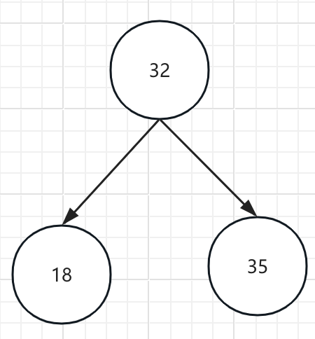
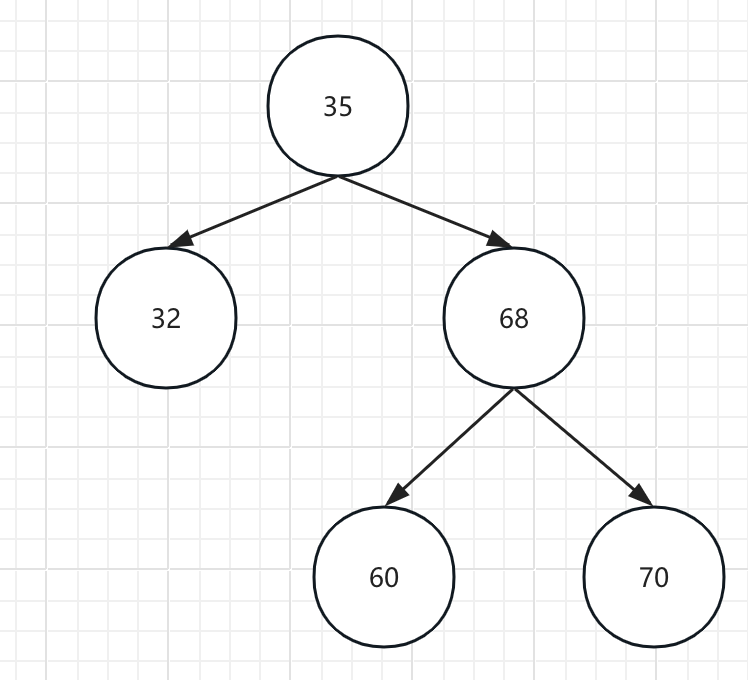
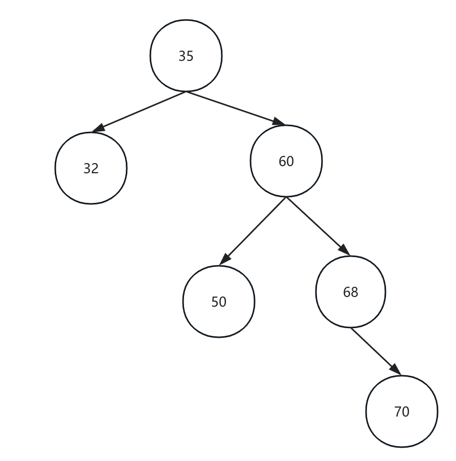
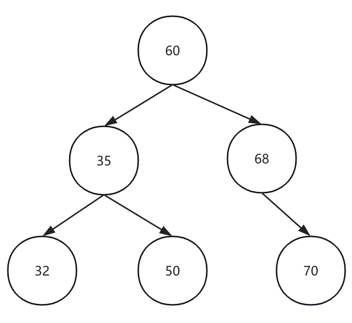
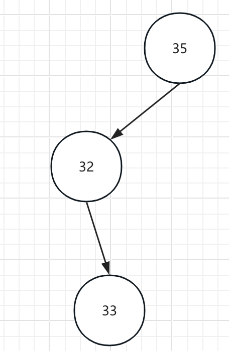
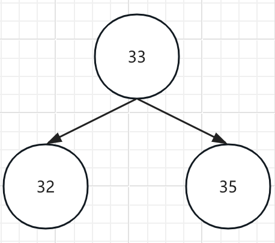
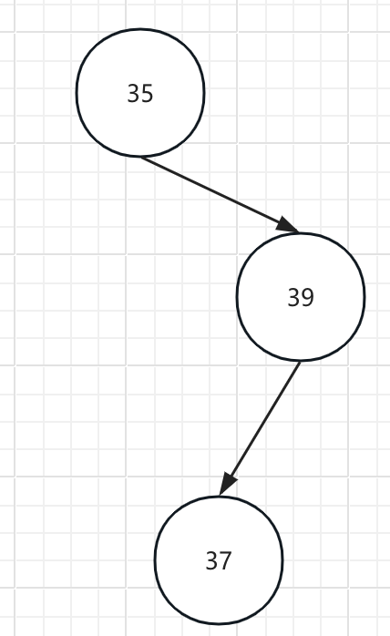
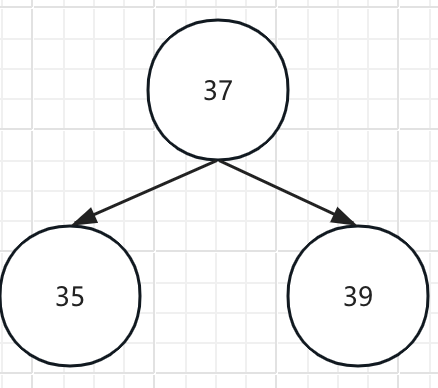
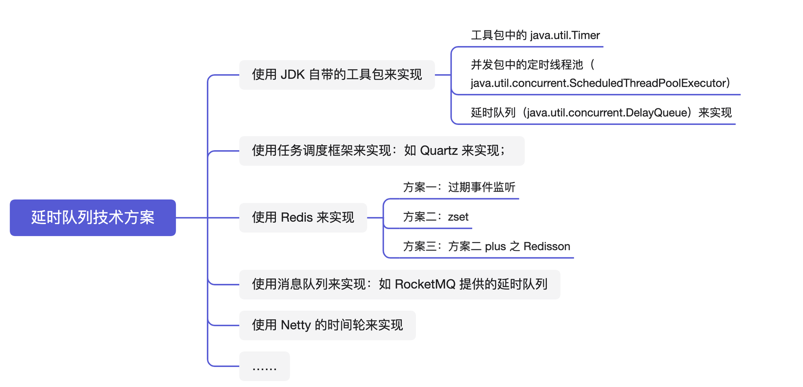
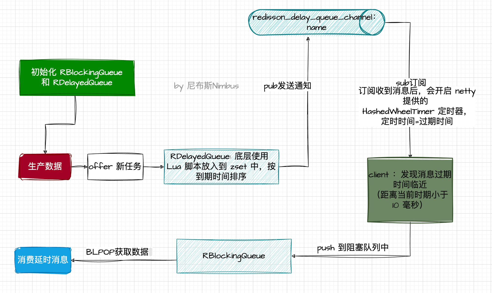

# 实现排名思想

> 解决一个问题的思想？

- 先考虑并发量不大，业务性能要求不高的情况下，可以用哪些实现方式
- 考虑并发量

1. 设计排名的时候，如果第一次查询第一页，发现是前十个人，然后这时候排名变化了，后面的跑到了第一页，第一页的跑到了第二页。点击第二页，发现第二页中有前面第一页的数据。

   解决思想：

   1. 简单的系统

      定时每个小时统计一次，存储到内存中。

   2. 更新得分很快，实时性要求较高

      树结构实现。使用平衡二叉树（平衡因子小于2）。

      思考：为什么不使用堆？

      多次操作进行合并，一次处理（相当于pipeline）

## 平衡二叉树

平衡二叉树：左子树 < 父节点 < 右子树，平衡因子小于2

如下所示，35的左子树高为1，右子树高为2，2-1<2 那么以35为根节点的树就是平衡二叉树，反之不是。

使用场景：排名相关的查找需求

时间复杂度：O(nlogn)

## 平衡二叉树的crud

1. 介绍几种基本类型，了解这几种类型，任何树都可以把他变成平衡二叉树
   - LL型
     - 破坏的节点在根节点的左边的左边（35的左子树高为2，右子树高为0）
     
       
     
     - 如何让其变成平衡二叉树
     
       > 进行一次右旋
     
       右旋时，原来的根节点当作新的右节点，原来的左节点做新的根节点。原来左节点的右节点（图上未标出，也就是32的右节点）变成新的右节点的左节点（也就是35的左节点）。原来左节点的左节点，变成新的根节点的左节点。
     
       
     
     
     
   - RR型
     
     - 破坏的节点在根节点右边的右边
     
       
     
       > 进行一次左旋
     
       只需要从被破坏的节点开始修改，这里就是60节点被破坏了，只需要以60为基准进行左旋。
     
       
     
     - 也是RR型
     
       
     
       > 新增70，被破坏节点是35，以35为基准进行一次左旋
     
       
     
       
     
   - LR型
     - 
     
       > 先对第二个节点32进行左旋，再对根节点35进行一次右旋
     
       
     
   - RL型
   
     - 
   
       > 先对第二个节点进行右旋，再对根节点进行左旋
   
       
   
1. 增加节点
   
   - 在对平衡二叉树增加节点的时候很可能将平衡二叉树变得不平衡了，这时候就需要用到上面的几种情况了。
   
1. 删除节点
   
   - 删除节点后也可能出现上述情况的一种，出现对应情况对应解决即可。

# <a href = "https://articles.zsxq.com/id_9ju6c5wvnenz.html">Redis实现延迟消息</a>

1. 业务场景

   <ol><li data-list="bullet">任务调度：延时队列可以用于任务调度，将需要在未来某个特定时刻执行的任务放入队列中。</li><li data-list="bullet">消息延迟处理：延时队列可以用于消息系统，其中一些消息需要在一段时间后才能被消费。例如，在需要进行消息重试的情况下，可以将消息放入延时队列，并在一段时间后重新处理。</li><li data-list="bullet">订单处理：在电商系统中，有时需要对订单进行一些处理，例如取消未支付的订单或处理退货请求。</li><li data-list="bullet">会员到期提醒：如果你有一个会员制度，需要提醒会员其订阅即将到期，延时队列可以用于安排在到期日期前发送提醒通知。</li><li data-list="bullet">缓解高峰期负载：在高峰期，系统可能会面临大量的请求和负载。延时队列可以用于将一些请求推迟处理，进行削峰处理。</li></ol>

2. 技术方案

   

3. 使用redis实现延时消息

   - 过期事件监听
   - Redis zset（有序集合）
   - Redisson

   Redisson实现：

   Redisson 封装了两个核心队列：RBlockingQueue 和 RDelayedQueue，其中 RDelayedQueue 作为中间队列，RBlockingQueue 作为目标消费队列。

   

   Redisson方案优点

   
<strong>1. 简单易用</strong>：可以通过注册监听的方式获取延时消息。

   
<strong>2. 批量处理，低延迟</strong>：Redisson 延时队列使用定时任务进行批量处理，而不是每个任务都单独处理。这种批处理方式减少了与Redis的通信次数，提高了处理效率。

   
<strong>3. 异步处理</strong>：Redisson的延时队列支持异步任务处理，减少了等待时间和阻塞，提升了整体的吞吐量和响应性能。

   
<strong>4. 支持分布式</strong>：Redisson的延时队列可以在分布式环境中使用，并提供了分布式锁和协调机制，确保多个节点或实例之间的任务处理的一致性和可靠性。

   
<strong>5.  延迟更低</strong>：Redisson 底层使用了 HashedWheelTimer，基于时间轮算法，具有高性能、较高精确度、内存友好、并发安全的特点。

   # 短信模块

   曾经写的短信登录还有些问题，限制都是依赖第三方来限制，自己没有进行限制。

   1. 没有校验发送频率
      - 通过手机号限制
      - 通过ip限制
      - 每日最大发送量限制
   2. 有多功能限制
      - 可以设置模板，添加请求字段，属于发送验证码、还是忘记密码等这类消息。
        - 传递手机号（String）、消息类型（Integer）给后端。
        - 通过消息类型选择appsecret、短信模版等。
   3. 设置登录登出的参数不完整，设置枚举
      - 账号登录
      - 社交登录（微信、企业微信、QQ）
      - 手机号验证码登录
      - 自己主动登出
      - 被管理员强制退出

