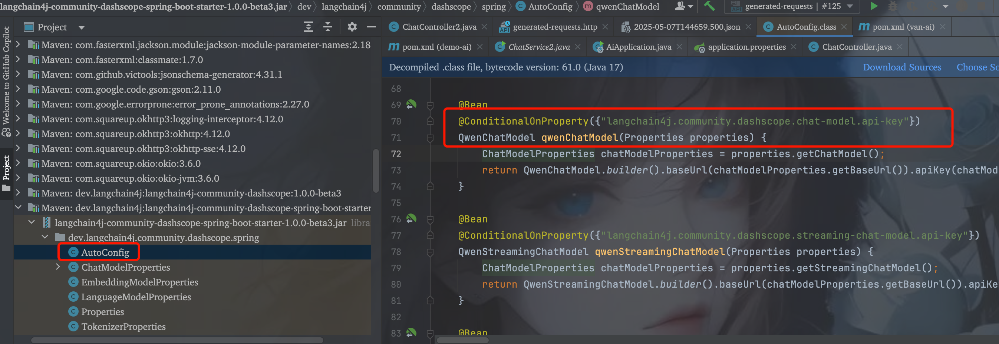
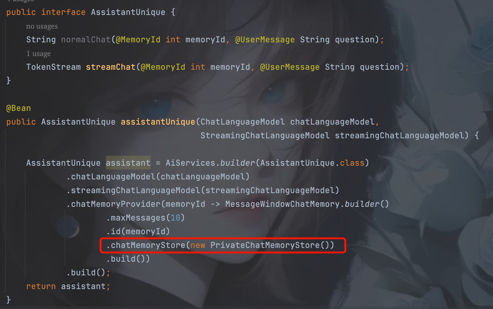
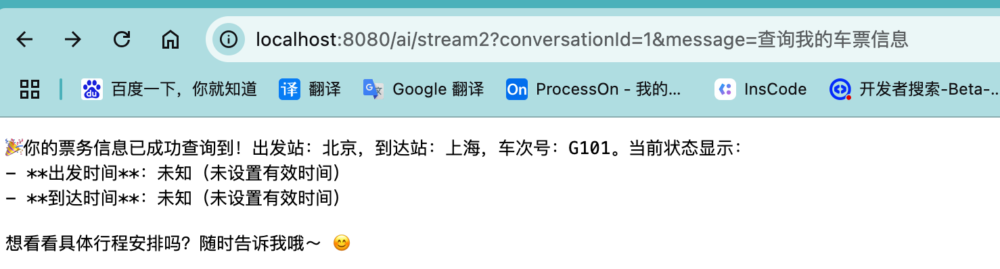
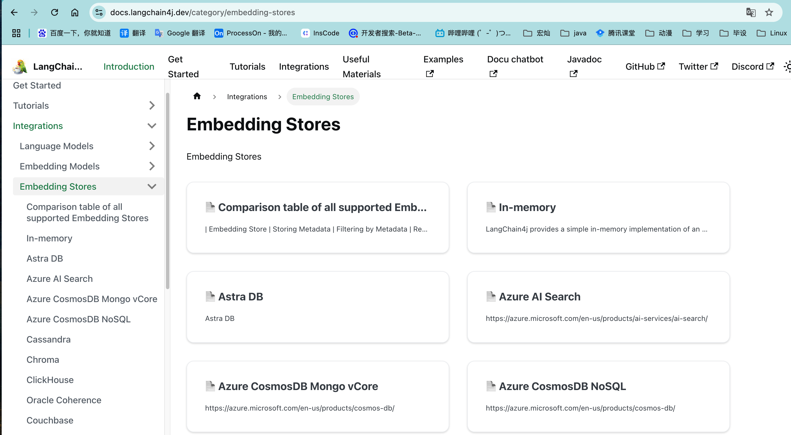
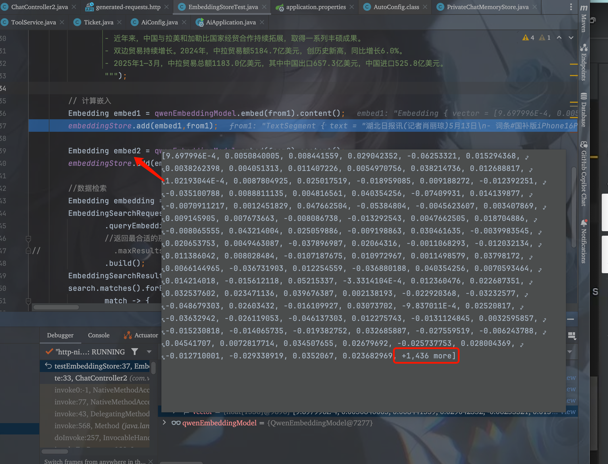
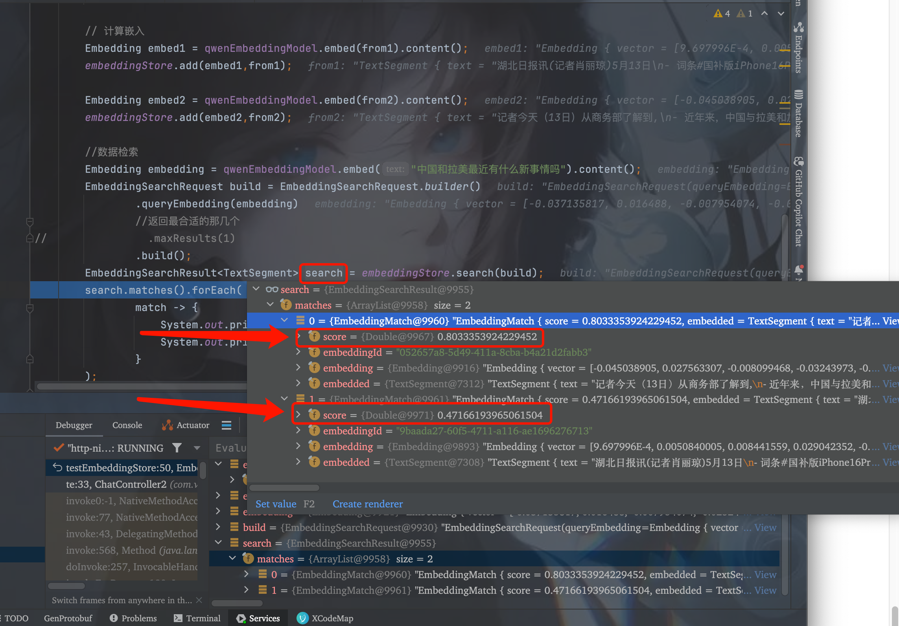

# LangChain4j

langchain4j和spring ai都可以集成大模型，但是spring ai只适合单机的，不能模型切换。

## 基本使用

```xml
<dependency>
  <groupId>dev.langchain4j</groupId>
  <artifactId>langchain4j</artifactId>
  <version>1.0.0-beta3</version>
</dependency>
<dependency>
  <groupId>dev.langchain4j</groupId>
  <artifactId>langchain4j-open-ai</artifactId>
  <version>1.0.0-beta3</version>
</dependency>
```

使用的时候可以使用提供的demo key，这是默认提供的。

```java
@Test
public void testChatWithFunction() {
  OpenAiChatModel model = OpenAiChatModel
    .builder()
    .baseUrl("http://langchain4j.dev/demo/openai/v1")
    .apiKey("demo")
    .modelName("gpt-4o-mini")
    .build();
  String response = model.chat("你好，我怎么称呼你？");
  System.out.println("Response: " + response);
}
```

模型的依赖从https://docs.langchain4j.dev/integrations/language-models/官网找，其中DashScope就是阿里的。

## 使用阿里的模型

从官网找到依赖：

```xml
<!--阿里的依赖，可以用阿里百炼中的大模型-->
<dependency>
    <groupId>dev.langchain4j</groupId>
    <artifactId>langchain4j-community-dashscope</artifactId>
    <version>${langchain4j.version}</version>
</dependency>
```

阿里有个文生图的模型，万象的：（deepseek目前不支持文生图）

```java
WanxImageModel model = WanxImageModel.builder()
  .modelName("wanx2.1-t2i-plus")
  .apiKey("sk-dd1783721ceb4f1f99032a4fa756dccd")
  .build();
Response<Image> generate = model.generate("猫咪");
System.out.println(generate.content().url());
```


## 整合springboot

1. 导入依赖

```xml
<parent>
  <groupId>org.springframework.boot</groupId>
  <artifactId>spring-boot-starter-parent</artifactId>
  <version>3.4.3</version>
  <relativePath/>
</parent>

<dependencies>
  <dependency>
    <groupId>org.springframework.boot</groupId>
    <artifactId>spring-boot-starter-web</artifactId>
  </dependency>
  <dependency>
    <groupId>dev.langchain4j</groupId>
    <artifactId>langchain4j-community-dashscope-spring-boot-starter</artifactId>
  </dependency>
</dependencies>

<dependencyManagement>
  <dependencies>
    <dependency>
      <groupId>dev.langchain4j</groupId>
      <artifactId>langchain4j-community-bom</artifactId>
      <version>${langchain4j.version}</version>
      <type>pom</type>
      <scope>import</scope>
    </dependency>
  </dependencies>
</dependencyManagement>
```

2. 配置文件

   ```properties
   langchain4j.community.dashscope.chat-model.api-key=sk-xxxxxx
   langchain4j.community.dashscope.chat-model.model-name=qwen-max
   ```

   配置哪些属性在这可以看见：

   当有这些属性存在时，会注入这些类

   

3. 编写代码，自动注入model

   ```java
   @Autowired
   QwenChatModel qwenChatModel;
   @RequestMapping("/chat")
   public String ask(@RequestParam String message) {
     return qwenChatModel.chat(message);
   }
   ```

## 流式输出

一点一点输出，不是一次性全部出来
```properties
langchain4j.community.dashscope.chat-model.api-key=sk-xx
langchain4j.community.dashscope.chat-model.model-name=qwen-max
# 下面这两个是流式输出的配置
langchain4j.community.dashscope.streaming-chat-model.api-key=sk-xx
langchain4j.community.dashscope.streaming-chat-model.model-name=qwen3-0.6b
```

```java
@RequestMapping("/stream")
public void stream(@RequestParam String message) {
  //qwen3-0.6b
  qwenStreamingChatModel.chat(message, new StreamingChatResponseHandler() {
    //这输出一次，相当于一个token
    @Override
    public void onPartialResponse(String s) {
      System.out.println(s);
    }

    @Override
    public void onCompleteResponse(ChatResponse chatResponse) {
      System.out.println("完成");
    }

    @Override
    public void onError(Throwable throwable) {
      throwable.printStackTrace();
    }
  });
}
```

为了让前端显示，可以用Flux

引入flux

```xml
<dependency>
  <groupId>org.springframework.boot</groupId>
  <artifactId>spring-boot-starter-webflux</artifactId>
</dependency>
```

```java
@RequestMapping("/stream")
public Flux<String> stream(@RequestParam String message) {
  Flux<String> flux = Flux.create(sink -> {
    //qwen3-0.6b
    qwenStreamingChatModel.chat(message, new StreamingChatResponseHandler() {
      //这输出一次，相当于一个token
      @Override
      public void onPartialResponse(String s) {
        sink.next(s);
      }

      @Override
      public void onCompleteResponse(ChatResponse chatResponse) {
        sink.complete();
      }

      @Override
      public void onError(Throwable throwable) {
        sink.error(throwable);
      }
    });
  });
  return flux;
}
```

## 记忆对话

底层是动态代理实现

历史聊天记录默认存在内存中，可以存到数据库或者redis里。

langchain4j将历史对话存储，发送给ai的时候会带上。

配置类：

```java
@Configuration
public class AiConfig {
    public interface Assistant {
        TokenStream chat(String question);
    }

    @Bean
    public Assistant assistant(ChatLanguageModel chatLanguageModel,
                               StreamingChatLanguageModel streamingChatLanguageModel) {
      //设置最大记住十条
        MessageWindowChatMemory memory = MessageWindowChatMemory.withMaxMessages(10);
        Assistant assistant = AiServices.builder(Assistant.class)
                .chatLanguageModel(chatLanguageModel)
                .streamingChatLanguageModel(streamingChatLanguageModel)
                .chatMemory(memory)
                .build();
        return assistant;
    }
}
```

使用的时候注入Assistant即可

```java
@Autowired
AiConfig.Assistant assistant;

@RequestMapping(value = "/stream",produces = "text/stream;charset=utf-8")
public Flux<String> stream(@RequestParam String message) {
  TokenStream stream = assistant.chat(message);
  Flux<String> flux = Flux.create(sink -> {
    stream.onPartialResponse(s -> sink.next(s))
      .onCompleteResponse(s -> sink.complete())
      .onError(sink::error)
      .start();
  });
  return flux;
}
```

> 多用户区分对话

上述记忆对话会将所有对话都记录起来，如果有多个用户，或者一个用户有多个对话框。那么就没区分了。所以需要加区分功能。

加一个memoryId来区分，如果用内存存储历史对话，结构是Map，就可以通过key为id来取记录。

`配置类：`

```java
public interface AssistantUnique {
  String normalChat(@MemoryId int memoryId, @UserMessage String question);
  TokenStream streamChat(@MemoryId int memoryId, @UserMessage String question);
}

@Bean
public AssistantUnique assistantUnique(ChatLanguageModel chatLanguageModel,
                                       StreamingChatLanguageModel streamingChatLanguageModel) {

  AssistantUnique assistant = AiServices.builder(AssistantUnique.class)
    .chatLanguageModel(chatLanguageModel)
    .streamingChatLanguageModel(streamingChatLanguageModel)
    .chatMemoryProvider(memoryId -> MessageWindowChatMemory.builder()
                        .maxMessages(10)
                        .id(memoryId)
                        .build())
    .build();
  return assistant;
}
```

`使用：`

```java
@Autowired
AiConfig.AssistantUnique assistantUnique;

@RequestMapping(value = "/stream2",produces = "text/stream;charset=utf-8")
public Flux<String> stream2(@RequestParam Integer conversationId, @RequestParam String message) {
  TokenStream stream = assistantUnique.streamChat(conversationId, message);
  Flux<String> flux = Flux.create(sink -> {
    stream.onPartialResponse(s -> sink.next(s))
      .onCompleteResponse(s -> sink.complete())
      .onError(sink::error)
      .start();
  });
  return flux;
}
```

## 历史对话持久化到数据库

只需要实现ChatMemoryStore类即可

```java
public class PrivateChatMemoryStore implements ChatMemoryStore {
    @Override
    public List<ChatMessage> getMessages(Object memoryId) {
        //从数据库中查询
        return null;
    }

    @Override
    public void updateMessages(Object memoryId, List<ChatMessage> list) {
        //更新数据库
    }

    @Override
    public void deleteMessages(Object memoryId) {
        //删除数据库
    }

}
```

然后将定义的ChatMemoryStore通过chatMemoryProvider设置到AiServices的构造中。




## Function-call

有些大模型不支持function-call，使用之前需要鉴别一下

什么是function-call？

定义一些函数给大模型调用，告诉大模型你这个函数的定义，以及参数说明。

当用户问到和这个相关的话题时，会调用提供的接口并将返回的参数进行封装。再返回给用户。

```java
@Service
public class ToolService {
    static List<Ticket> list = new ArrayList<>();
    static {
        list.add(new Ticket("G101", "lisi", "Beijing", "Shanghai", null, null));
        list.add(new Ticket("G102", "lisi", "Beijing", "Guangzhou", null, null));
        list.add(new Ticket("G103", "zhangsan", "Beijing", "Shenzhen", null, null));
        list.add(new Ticket("G104", "zhangsan", "Beijing", "Hangzhou", null, null));
        list.add(new Ticket("G105", "wangwu", "Beijing", "Nanjing", null, null));
        list.add(new Ticket("G106", "wangwu", "Beijing", "Wuhan", null, null));
    }
  
    @Tool("根据车次号和用户名获取车票信息")
    public List<Ticket> getTicketsByUsername(@P("用户名") String username, @P(value = "车次号",required = false) String numberId) {
        System.out.println("11111111111111111");
        if (ObjectUtils.isEmpty(numberId)) {
            return list.stream().filter(ticket -> ticket.getName().equals(username)).collect(Collectors.toList());
        }
        return list.stream().filter(ticket -> ticket.getNumberId().equals(numberId) && ticket.getName().equals(username))
                .collect(Collectors.toList());
    }

    @Tool("为用户订票")
    public boolean setTickets(@P("用户名") String username, @P(value = "车次号") String numberId,
                                   @P("出发站") String startStation, @P("到达站") String endStation,
                                   @P("出发时间") String startTime, @P("到达时间") String endTime) {
        System.out.println("22222222222222222");
        list.add(new Ticket(numberId, username, startStation, endStation, new Date(), new Date()));
        return true;
    }
    @Tool("为用户退票")
    public boolean deleteTickets(@P("用户名") String username, @P(value = "车次号") String numberId) {
        list.removeIf(ticket -> ticket.getNumberId().equals(numberId) && ticket.getName().equals(username));
        return true;
    }
}
```

在初始化接口时将tool设置进去

```java
@Bean
public AssistantUnique assistantUnique(ChatLanguageModel chatLanguageModel,
                                       StreamingChatLanguageModel streamingChatLanguageModel,
                                       ToolService toolService) {
  AssistantUnique assistant = AiServices.builder(AssistantUnique.class)
    .chatLanguageModel(chatLanguageModel)
    .streamingChatLanguageModel(streamingChatLanguageModel)
    .chatMemoryProvider(memoryId -> MessageWindowChatMemory.builder()
                        .maxMessages(10)
                        .id(memoryId)
                        .build())
    //在这里设置
    .tools(toolService)
    .build();
  return assistant;
}
```

在接口中也可以设置模型的提示词，这里如果想向提示词中传递参数，可以用{{}}括起来，参数用@V注解

```java
public interface AssistantUnique {
  String normalChat(@MemoryId int memoryId, @UserMessage String question);
  @SystemMessage("""
                 你是票务助手，帮助人们查询、修改、新增、删除票务信息，但是你的脾气很火爆，喜欢骂人
                 在提供有关信息前，必须从用户那获取车次号和姓名
                 今天的日期是 {{current_date}}
                 """)
  TokenStream streamChat(@MemoryId int memoryId, @UserMessage String question,
                        @V("current_date") String currentDate);
}
```


之前已经告诉过他我是谁，然后问查询我的车票信息，如下




## RAG

什么是RAG？

- 将一段文本或者文件embding到向量数据库中（通过向量模型生成向量数据，再将数据插入到数据库）
- 当用户提问的时候，把问题通过向量模型转换成向量数据。再去数据库检索，将检索出的数据和用户提问的数据发给大模型得到结果

简而言之包含两个阶段：索引阶段和检索阶段

### Rag中常见的名词

- Document

- Metadata
  - 存储着键值对，key是String，value支持String,Integer, Long, Float, Double.
  - 放入prompt时，可以增强LLM的理解能力。可以更加精准的检索数据。可以根据metadata更新替换数据。

- Document Loader
  - 文件加载器，可以从各个地方加载文件
- Document Parser
  - 解析各种文件，又loader加载到文件然后通过parser读取解析成Document。
- Document Transformer
  - 在文档还没拆分成段（TextSegment）之前，对整个文档进行预处理、增强和过滤的组件。
  - 比如移除无用内容，广告、乱码、格式符等。
  - 过滤不需要的文档，草稿。
  - 加统一的metadata，作者、来源、分类等。
  - 目前默认的是HtmlToTextDocumentTransformer、可以去除<script>等这种标签，适合爬虫爬下来的数据。

- Text Segment

- Document Splitter
  - 分词器

- Text Segment Transformer
  - 对Text Segment再进行处理，比如加metadata

- Embedding

- Embedding Model
  - 向量模型，将文本转化成向量数据

- Embedding Store
  - 向量数据库

- Embedding Store Ingestor
  - 统一处理数据并注入向量库，来源可以是文档，可以是数据库


### 向量数据库

有很多，不过一般都用存储在磁盘上的，es这种。这里用in-memory做学习用。




### 向量模型

把文本或者文件转换成向量数据。

### 展示代码

`application.properties`

```properties
langchain4j.community.dashscope.embedding-model.api-key=sk-xxx
```

```java
@Component
public class EmbeddingStoreTest {
    @Autowired
    QwenEmbeddingModel qwenEmbeddingModel;
    public static final InMemoryEmbeddingStore<TextSegment> embeddingStore = new InMemoryEmbeddingStore<>();
    public void testEmbeddingStore() {
        // 创建一个文本片段
        TextSegment from1 = TextSegment.from("""
                湖北日报讯(记者肖丽琼)5月13日
                - 词条#国补版iPhone16Pro被抢空#登上微博热搜，引起网友热议。
                - 记者了解到，被“抢空”的机型为iPhone16Pro128GB。
                - 尽管京东已进行多轮补货，但湖北该款机型仍处于“一机难求”的状态。
                - 这一抢购热潮背后，国补政策与618大促的叠加效应发挥了关键作用。
                    """);
        TextSegment from2 = TextSegment.from("""
                记者今天（13日）从商务部了解到,
                - 近年来，中国与拉美和加勒比国家经贸合作持续拓展，取得一系列丰硕成果。
                - 双边贸易持续增长。2024年，中拉贸易额5184.7亿美元，创历史新高，同比增长6.0%。
                - 2025年1—3月，中拉贸易总额1183.0亿美元，其中中国出口657.3亿美元，中国进口525.8亿美元。
                """);
        // 将文本转换成向量
        Embedding embed1 = qwenEmbeddingModel.embed(from1).content();
        // 将向量存储到内存中，等于存储到数据库
        embeddingStore.add(embed1,from1);

        Embedding embed2 = qwenEmbeddingModel.embed(from2).content();
        embeddingStore.add(embed2,from2);

        //数据检索
        Embedding embedding = qwenEmbeddingModel.embed("中国和拉美最近有什么新事情吗").content();
        //构造检索请求体
        EmbeddingSearchRequest build = EmbeddingSearchRequest.builder()
                .queryEmbedding(embedding)
                //返回最合适的那几个
//                .maxResults(1)
                //可以设置最小相似得分，如果小于这个值就不反回
//                .minScore(0.7)
                .build();
        //执行检索
        EmbeddingSearchResult<TextSegment> search = embeddingStore.search(build);
        //输出检索结果
        search.matches().forEach(
                match -> {
                    System.out.println("相似度: " + match.score());
                    System.out.println("文本: " + match.embedded().text());
                }
        );
    }
}
```

`输出结果：`

```shell
相似度: 0.8033353924229452
文本: 记者今天（13日）从商务部了解到,
- 近年来，中国与拉美和加勒比国家经贸合作持续拓展，取得一系列丰硕成果。
- 双边贸易持续增长。2024年，中拉贸易额5184.7亿美元，创历史新高，同比增长6.0%。
- 2025年1—3月，中拉贸易总额1183.0亿美元，其中中国出口657.3亿美元，中国进口525.8亿美元。

相似度: 0.47166193965061504
文本: 湖北日报讯(记者肖丽琼)5月13日
- 词条#国补版iPhone16Pro被抢空#登上微博热搜，引起网友热议。
- 记者了解到，被“抢空”的机型为iPhone16Pro128GB。
- 尽管京东已进行多轮补货，但湖北该款机型仍处于“一机难求”的状态。
- 这一抢购热潮背后，国补政策与618大促的叠加效应发挥了关键作用。
```

下图可以看出，这个向量模型把数据提取出了1436个特征。



下图所示，检索的结果包含相似度和之前插入的内容。



后续要使用的时候会把用户的提问和检索出的结果都给大模型。让模型给出结果。

### 分词 Document Splitter

分词器的选择很大程度上决定了检索的准确性。

将文档切分成多个小的text segment

langchain4j提供了以下这些分词器

- `DocumentByParagraphSplitter`
- `DocumentByLineSplitter`
- `DocumentBySentenceSplitter`
- `DocumentByWordSplitter`
- `DocumentByCharacterSplitter`
- `DocumentByRegexSplitter`
- Recursive: `DocumentSplitters.recursive(...)`

可以自定义分词器

```java
public class VanDocumentSplitter implements DocumentSplitter {
    @Override
    public List<TextSegment> split(Document document) {
        String text = document.text();
        String[] split = text.split("。");
        ArrayList<TextSegment> textSegments = new ArrayList<>();
        //todo 具体的分词逻辑
        //todo ...
        return textSegments;
    }
}
```

### 结合springboot使用

```java
@Configuration
public class AiConfig {
    public interface AssistantUnique {
        String normalChat(@MemoryId int memoryId, @UserMessage String question);
    }
    @Bean
    InMemoryEmbeddingStore<TextSegment> inMemoryEmbeddingStore() {
        return new InMemoryEmbeddingStore<>();
    }
    @Bean
    public AssistantUnique assistantUnique(ChatLanguageModel chatLanguageModel,
                                           InMemoryEmbeddingStore<TextSegment> inMemoryEmbeddingStore,
                                           QwenEmbeddingModel qwenEmbeddingModel) {
        EmbeddingStoreContentRetriever contentRetriever = EmbeddingStoreContentRetriever.builder()
                .embeddingStore(inMemoryEmbeddingStore)
                .embeddingModel(qwenEmbeddingModel)
                .maxResults(5)
                .minScore(0.1)
                .build();
        AssistantUnique assistant = AiServices.builder(AssistantUnique.class)
                .chatLanguageModel(chatLanguageModel)
                .contentRetriever(contentRetriever)
                .chatMemoryProvider(memoryId->MessageWindowChatMemory.withMaxMessages(10))
                .build();
        return assistant;
    }

}
```

```java
/**
 * 项目启动后自动执行
 */
@Component
public class EmbeddingRunner implements ApplicationRunner {
    @Autowired
    InMemoryEmbeddingStore<TextSegment> inMemoryEmbeddingStore;
    @Autowired
    QwenEmbeddingModel qwenEmbeddingModel;
    @Override
    public void run(ApplicationArguments args) {
        //初始化向量库
        Document document = FileSystemDocumentLoader.loadDocument("/Users/liujian/repository/van-ai/demo-ai/src/main/resources/embedding/a.txt",new TextDocumentParser());
        DocumentByLineSplitter documentByLineSplitter = new DocumentByLineSplitter(100, 20);
        List<TextSegment> textSegments = documentByLineSplitter.split(document);
        //将文本转换成向量并存储到向量数据库
        for (TextSegment textSegment : textSegments) {
            //将文本转换成向量
            Response<Embedding> embed = qwenEmbeddingModel.embed(textSegment);
            Embedding content = embed.content();
            //将向量存储到向量数据库（这里用内存向量数据库）
            inMemoryEmbeddingStore.add(content, textSegment);
        }

    }
}
```

```java
@RestController
@RequestMapping("/ai")
public class ChatController2 {
    @Autowired
    AiConfig.AssistantUnique assistantUnique;
    @RequestMapping("/chat3")
    public String chat3(@RequestParam("message") String message,@RequestParam("memoryId") Integer memoryId){
        String s = assistantUnique.normalChat(memoryId, message);
        return s;
    }
}
```


## MetaData

每个segment都可以有多个metadata，metadata并不参与向量计算，而是起到一个标签作用。比如要删除某个向量数据时可以用自定义的某个唯一的metadata来查询删除对应的向量数据。metadata也可以用来存储数据来源（比如网页，数据库，pdf，word等），看开发者自己想如何设置。

针对来源为数据库中的数据在向量库中删除，可以根据表中唯一标识来删。

针对通过文档录入到向量库中的数据，在录入时可以分段设置metadata，也可以整个文档设同样的metadata，如果设置分段的，删除的时候可以分段删除，按文档分的只能从向量库中删除整个文档。

所以将数据入向量库的时候，需要仔细斟酌metadata。

一般metadata包含以下内容：

| 字段名        | 类型           | 含义与用途                     |
| ------------- | -------------- | ------------------------------ |
| `source`      | `String`       | 数据来源，如文件名、表名、URL  |
| `doc_id`      | `String`       | 文档唯一标识，便于更新/删除    |
| `segment_id`  | `String`       | 每个段落的唯一标识（可选）     |
| `title`       | `String`       | 内容的标题或章节名称           |
| `category`    | `String`       | 分类标签，如“金融/医疗/政务”等 |
| `created_at`  | `String`       | 创建时间，用于提示时序性       |
| `updated_at`  | `String`       | 数据最后更新时间               |
| `author`      | `String`       | 作者或发布者信息               |
| `url`         | `String`       | 网页来源 URL                   |
| `page_number` | `Integer`      | 文档页码（PDF、Word等）        |
| `language`    | `String`       | 内容语言（如 "zh", "en"）      |
| `version`     | `String`       | 文档或知识的版本号             |
| `tags`        | `List<String>` | 多标签（如用于过滤）           |

删除的时候使用

先看一下使用DocumentByLineSplitter分词返回的默认的metadata

```json
TextSegment {
            text = "湖北日报讯(记者肖丽琼)5月13日
                词条#国补版iPhone16Pro被抢空#登上微博热搜，引起网友热议。
                记者了解到，被“抢空”的机型为iPhone16Pro128GB。"
            metadata = {
                absolute_directory_path=/Users/liujian/repository/van-ai/demo-ai/src/main/resources/embedding, index=0, file_name=a.txt
            }
}
```

这种默认的metadata也可以重新设置存入。`删除的时候通过metadata删除`

```java
/**
 * 项目启动后自动执行
 */
@Component
public class EmbeddingRunner implements ApplicationRunner {
    @Autowired
    InMemoryEmbeddingStore<TextSegment> inMemoryEmbeddingStore;
    @Autowired
    QwenEmbeddingModel qwenEmbeddingModel;
    @Override
    public void run(ApplicationArguments args) {
        //初始化向量库
        Document document = FileSystemDocumentLoader.loadDocument("/Users/liujian/repository/van-ai/demo-ai/src/main/resources/embedding/a.txt",new TextDocumentParser());
        DocumentByLineSplitter documentByLineSplitter = new DocumentByLineSplitter(100, 20);
        List<TextSegment> textSegments = documentByLineSplitter.split(document);

        //直接返回的metadata是默认的：
        //这种默认的可能不适合我们的业务，可以再重新自定义一下
        List<TextSegment> segmentsWithMetadata = new ArrayList<>();

        //将文本转换成向量并存储到向量数据库
        for (int i = 0; i < textSegments.size(); i++) {
            TextSegment tempSegment = textSegments.get(i);
            Map<String, String> mapMetadata = new HashMap<>();
            mapMetadata.put("source","a.txt");
            mapMetadata.put("doc_id", "1");
            mapMetadata.put("segment_index", String.valueOf(i));
            Metadata metadata = new Metadata(mapMetadata);
            TextSegment textSegment = new TextSegment(tempSegment.text(), metadata);
            segmentsWithMetadata.add(textSegment);
            //将文本转换成向量
            Embedding content = qwenEmbeddingModel.embed(textSegment).content();
            //将向量存储到向量数据库（这里用内存向量数据库）
            inMemoryEmbeddingStore.add(content, textSegment);
        }
      
        //删除时通过metadata删除
        inMemoryEmbeddingStore.removeAll(
                metadata->{
                    //删除向量数据库中所有的文本段
                    Metadata metadata1 = (Metadata) metadata;
                    return "a.txt".equals(metadata1.getString("source"));
                }
        );
    }
}
```


# 使用场景

- 当数据不经常变动时适合使用知识库，否则实时性要求高的且数据经常变动的，不建议做成知识库。
- 非要做的话可以一天更新一次向量库，比如mysql看updata_time的变化，如果大于上一次执行的时间，那么这条数据就更新插入。

- 针对mysql，需要将数据从结构化转化到非结构化数据（即自然语言），再存入向量库。


